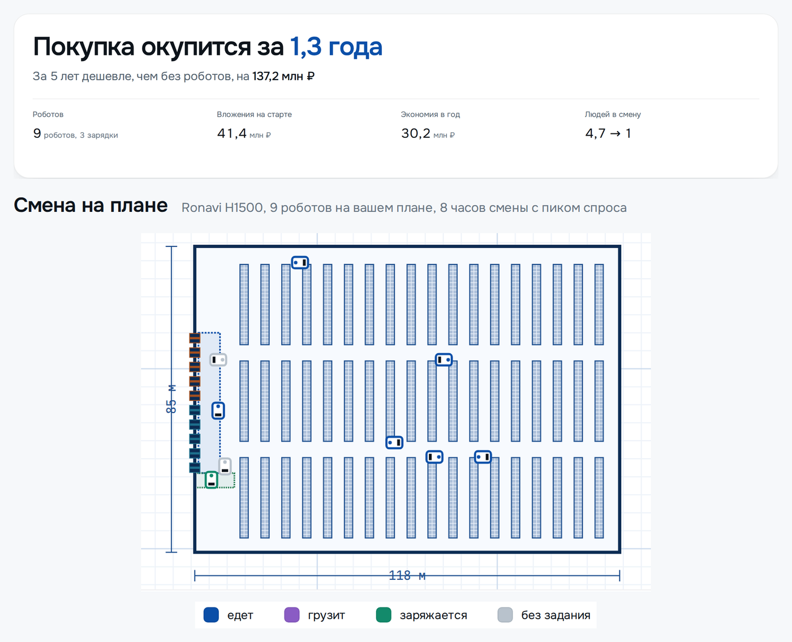

# Расклад

Расклад это веб-сервис для расчета роботизации объекта: склада, аэропорта, медучреждения. Он подбирает роботов из каталога, проверяет их число прогоном смены на плане и считает экономику. Команда unicorn, хакатон "Лидеры цифровой трансформации 2026", задача №1.

## Как посмотреть

1. Стенд: https://rasklad-robots.ru. Собран из закрытого репозитория с полным каталогом организатора (190 позиций). Вход по логину и паролю из документации в материалах сдачи.
2. Локально, из этого репозитория: docker compose up --build. Файлов организатора хакатона здесь нет(выгрузки каталога, фото и датасета). Так как по условию их нельзя публиковать. Сервис работает сразу: в нем 31 складское решение с характеристиками, которые мы собрали с сайтов производителей. Остальной каталог организатора, 190 позиций, загружается через админку файлом из материалов сдачи, см. раздел "Полный каталог из материалов сдачи" ниже.

Файлы организатора и наш дополненный каталог лежат в материалах сдачи на Яндекс.Диске, которые передаются вместе с проектом.

Методика расчета, все формулы с примерами руками: [docs/calculation.md](docs/calculation.md).

## Цель

Дать проверяемый ответ на вопрос "окупятся ли роботы на моем объекте и какие". Не рекламные цифры производителя, а расчет на данных клиента, где у каждой цифры есть источник и оценка доверия.

## Для кого

- Руководитель склада: нужны цифры для решения.
- Финансист: проверяет расчет по формулам и источникам.
- Интегратор: прикидывает проект клиенту.
- Администратор ФЦ БАС: ведет каталог решений и нормативы.

## Что делает

Подбирает решение под задачу объекта, считает, сколько нужно роботов и зарядок и во что они обойдутся за 5 лет, и показывает, от каких цифр результат зависит сильнее всего. Отчет выгружается в PDF и Excel.

Человек описывает склад и работу, которую хочет отдать роботам, чертит или берет типовой план, выбирает решение из каталога, и сервис считает парк, вложения, окупаемость и стоимость владения для трех сценариев: без роботов, покупка и роботы как услуга. Число роботов проверяет прогон смены: роботы ездят по плану клиента, стоят в очередях и заряжаются.



Сверху ответ шага экономики на демо-складе, под ним та же смена на плане: роботы в проездах в середине пикового часа, цвет показывает, что робот делает.

Демо-расчет на данных организатора: площадь зоны работы роботов 10 000 м2, перевозка 2 000 паллет в сутки, Ronavi H1500 на типовом плане. Нужно 9 роботов и 3 зарядки. Покупка: 41,4 млн ₽ на старте, окупится за 1,3 года, за 5 лет дешевле, чем без роботов, на 137,2 млн ₽. Роботы как услуга: 11,5 млн ₽ на старте, окупится за 0,5 года. Как повторить руками: [раздел 6.10 документации](docs/documentation.md#610-воспроизведение-демо-расчета).

## Где что находится

- Документация по ТЗ (разделы 6.1-6.10): [PDF](docs/documentation.pdf), [DOCX](docs/documentation.docx), [исходник](docs/documentation.md)
- Пример отчета по демо-расчету: [PDF](docs/example/report.pdf), [Excel](docs/example/report.xlsx), [запрос расчета](docs/example/request.json)
- Методика расчета с примерами руками: [docs/calculation.md](docs/calculation.md), картинками в сервисе: http://localhost:3000/method
- Журнал решений, что выбрали и почему: [docs/decisions.md](docs/decisions.md)
- Источники данных и оценка доверия S-F: [docs/data-sources.md](docs/data-sources.md), значения характеристик со ссылками: [data/specs/](data/specs/)
- Что сделано по каждому пункту ТЗ, что сверх ТЗ, что не делаем и что не вошло в срез: [docs/scope.md](docs/scope.md)
- Проверка датасета организатора: что взяли, что проверили, что поправили и что не используем: [docs/dataset-check.md](docs/dataset-check.md)
- Требования ТЗ списком с отметками: [docs/requirements.md](docs/requirements.md), границы MVP и риски: [docs/mvp.md](docs/mvp.md)
- Безопасность: [docs/security.md](docs/security.md)
- Описание API (OpenAPI): http://localhost:8000/api/docs после запуска
- Демо-входы при запуске у себя: пользователь `demo@example.com` / `demo12345`, администратор `admin@example.com` / `admin12345`, вход по почте и паролю на обычном экране входа
- Стенд: https://rasklad-robots.ru, закрыт общим логином и паролем, демо-вход выключен; логин и пароль стенда и демо-аккаунтов в материалах сдачи
- Сценарий проверки: [за 10 минут](#что-попробовать-за-10-минут) ниже, подробный на 14 шагов в [приложении Б документации](docs/documentation.md#приложение-б-демо-данные-и-сценарий-проверки-основных-функций)

## Требования ТЗ и где они сделаны

| Требование | Где сделано |
|---|---|
| Три типа объектов, параметры с единицами, источниками и границами | Шаги 1-2 мастера, [6.7](docs/documentation.md#67-руководство-пользователя-и-администратора) |
| Загрузка параметров из Excel и CSV с проверкой | Шаг 2, [6.6](docs/documentation.md#66-порядок-загрузки-и-обновления-данных) |
| Каталог с иерархией, источниками, датой и оценкой у каждой характеристики | Админка `/admin`, [6.6](docs/documentation.md#66-порядок-загрузки-и-обновления-данных) |
| Подбор с объяснением, исключением и пометкой "требует проверки" | Шаг 4, [6.4](docs/documentation.md#64-алгоритм-подбора-и-ранжирования-решений) |
| Парк, CAPEX, OPEX, эффект, окупаемость, ROI, TCO, амортизация | Шаг 5, [6.5](docs/documentation.md#65-экономическая-модель) |
| Три сценария: без роботов, покупка, роботы как услуга | Шаг 5, [пункт 4 ниже](#пять-тем-дополнений) |
| Чувствительность и вывод интервалом с рисками | Шаг 5, "Что будет, если", [6.5](docs/documentation.md#65-экономическая-модель) |
| 2D-схема с маршрутами, роботами, зарядкой, KPI и узким местом | Шаг 5, "Смена на плане", [6.7](docs/documentation.md#67-руководство-пользователя-и-администратора) |
| Роли, проекты с версиями, сравнение, повтор расчета по версии данных | Кабинет, [6.3](docs/documentation.md#63-архитектура-компоненты-структура-данных-api) |
| Отчет PDF и таблицы Excel | Шаг 5, [пример](docs/example/) |
| Запуск одной командой, СУБД, OpenAPI, 1366 на 768 | [6.2](docs/documentation.md#62-инструкция-по-развертыванию-и-запуску), `/api/docs` |
| Кредит, лизинг, господдержка, выход на режим | Шаг 5, панель "Условия и господдержка", [calculation.md](docs/calculation.md) |
| Автообновление каталога | Админка, "Проверить обновления", [6.6](docs/documentation.md#66-порядок-загрузки-и-обновления-данных) |

Частично: аэропорт и медучреждение доходят до параметров и списка решений, без плана и экономики; в подборе нет правил ровности пола, температуры, лифтов и WMS, этих полей нет в каталоге; живой интеграции с WMS и 1С нет, вместо нее импорт выгрузок и API; список задач объекта пока в коде. План развития: английский, план и экономика для аэропорта и больницы, перевозка коробов, больше двух решений на задачу, развитие чертежа, коннекторы к 1С и WMS ([6.9](docs/documentation.md#69-известные-ограничения-и-план-развития)).

По каждому пункту ТЗ подробно, со статусом, путем на экране и ссылкой на код: [docs/scope.md](docs/scope.md).

## Пять тем "Дополнений"

Подробно в разделе [Что мы прорабатывали сами](docs/documentation.md#что-мы-прорабатывали-сами).

1. [Исключение неподходящих решений](docs/documentation.md#1-условия-исключения-неподходящих-решений): задача, груз, проход, подъем, пандус, стеллажи; чего нет в источниках, то "требует проверки".
2. [CAPEX и OPEX покупки и услуги](docs/documentation.md#2-состав-capex-и-opex-для-сценариев-покупки-и-услуги): одни статьи в расчете, на экране и в отчете, сверены с легендой датасета.
3. [Допущения по неполным данным](docs/documentation.md#3-допущения-по-отсутствующим-или-неполным-данным): у каждой цифры источник и оценка, у слабых влияние на результат.
4. [Роботы как услуга](docs/documentation.md#4-логика-экономической-модели-роботы-как-услуга): разовый платеж, плата в месяц, порча, выкуп по остаточной стоимости, платежи по годам.
5. [Расширение каталога](docs/documentation.md#5-расширение-каталога-и-работа-с-открытыми-источниками): 31 решение склада с характеристиками, 12 для аэропорта, 18 для больницы, около 1 600 значений со ссылками.

## Как запустить

Нужен Docker.

```bash
cp .env.example .env
docker compose up --build
```

- интерфейс: http://localhost:3000, расчет без входа: http://localhost:3000/calc, вход: http://localhost:3000/login
- как мы считаем, методика картинками: http://localhost:3000/method
- описание API: http://localhost:8000/api/docs, служебные таблицы администратора: http://localhost:8000/api/db

При запуске создаются два демо-аккаунта: пользователь `demo@example.com` с паролем `demo12345` и администратор `admin@example.com` с паролем `admin12345`. Входят в них как в обычный аккаунт, по почте и паролю. Почты и пароли меняются в `.env`.

Для регистрации подойдет любая почта вида `ivan@example.com`, настоящую вводить не нужно: письма мы не шлем, а почту видит администратор сервиса.

В этом репозитории каталог из коробки 31 позиция: при первом запуске в базу ложатся наши складские решения с характеристиками из `data/specs`. Выгрузки каталога организатора в открытой версии нет: организатор разрешил держать ее только в закрытом репозитории. Загрузить ее может администратор через админку, см. ниже.

Вернуть демо-проекты и каталог в исходный вид: `docker compose exec backend python -m scripts.reset_demo`.

Стенд в интернете поднимается другой командой, с https, паролем на весь сайт и выключенным демо-входом: [docs/stand.md](docs/stand.md). Наш стенд: https://rasklad-robots.ru, логин и пароль в материалах сдачи.

### Полный каталог из материалов сдачи

Полный каталог (190 позиций, с фото и данными организатора) в открытой версии не публикуем по условию организатора хакатона. Проверить его можно двумя способами:

1. Открыть стенд https://rasklad-robots.ru - он собран из закрытого репозитория, каталог там уже полный.
2. Поднять сервис локально из этого репозитория и загрузить каталог самому: войти администратором (`admin@example.com` / `admin12345` из `.env.example`), открыть `/admin`, в разделе "Каталог решений" нажать "Загрузить выгрузку" и выбрать файл `catalog_export_v4.csv` из материалов сдачи (Диск, папка `data`).

## Что уже можно посмотреть

Полный путь сделан для склада, пять шагов:

1. Объект и задачи: склад, аэропорт, медучреждение. На складе перевозка паллет, отбор, уборка, можно несколько задач сразу.
2. Параметры: площадь зоны работы роботов, режим, объемы, масса груза, штат по ролям с окладами. Главные значения в явных полях с подсказкой строкой под полем, у каждого поля единица, источник и оценка доверия. Параметры можно загрузить из Excel или CSV по шаблону.
3. План склада: шаблон или свой чертеж на весь экран с рядами стеллажей, воротами, зарядками и контуром здания, в том числе по фото. Есть обучение с практикой на пустом плане.
4. Решение по каждой задаче: подбор из каталога карточками с главными цифрами (скорость, производительность, грузоподъемность) и объяснением, почему решение подходит, что мешает и откуда каждая цифра. На задачу можно взять одного робота или два разных с долей объема. Можно задать бюджет на старте: сервис покажет, сколько роботов в него влезает со всеми вложениями и что они вытянут за смену.
5. Экономика: сверху ответ словами и строка "Чем платить" (кредит и лизинг ползунками), сразу под ним смена на плане, где роботы ездят по вашему складу. Ниже блоки списком строк с главными числами, каждый раскрывается кнопкой "Подробнее": три сценария (без роботов, покупка, аренда) с окупаемостью, ROI, NPV, IRR, куда уходят деньги по статьям и годам, итог по каждой задаче, "что будет, если" по силе влияния, "что подготовить на складе" и откуда цифры. В "Что мы приняли за вас" можно поправить цену, обслуживание и срок службы робота. Отчет PDF и таблицы Excel скачиваются без входа.

У аэропорта и медучреждения путь заканчивается на параметрах и списке решений: плана и экономики для них нет. Дальше делаем больнице план корпуса по этажам с лифтом, аэропорту план терминала и перрона с волнами рейсов ([6.9](docs/documentation.md#69-известные-ограничения-и-план-развития)).

После входа человек попадает на свою главную: последний проект с главными числами и планом его склада, новое в каталоге роботов, ссылки на методику. Дальше кабинет: проекты с версиями, папки, сравнение проектов рядом, копия "что будет, если", ссылка "поделиться", профиль. В меню аккаунта настройки, там темная тема.

У администратора своя главная: что ждет его решения, графики по дням (сохранения расчетов, новые пользователи, правки каталога) и журнал правок. Он правит каталог решений (списком или деревом, в открытой версии 31 позиция, с загруженной выгрузкой организатора 190), выгружает его файлом и загружает обратно, правит нормативы, проверяет обновления характеристик на сайтах производителей. Служебные таблицы открываются каталогом.

### Что попробовать за 10 минут

1. Без входа: "Посчитать свой склад", пройти пять шагов, поменять объем или план, скачать PDF.
2. Зарегистрироваться, сохранить расчет, в кабинете сделать копию "что будет, если" и сравнить с оригиналом. Вернуться на главную: там план вашего склада.
3. На шаге 4 добавить к задаче второго робота или задать бюджет, на шаге 5 включить кредит или лизинг.
4. Войти демо-администратором: главная администратора, каталог деревом, раздел "Нормативы", "Проверить обновления".
5. Открыть "Как мы считаем" (/method): путь расчета, парк, сценарии, окупаемость, шкала доверия S-F.

Решения и допущения по ходу работы: [docs/decisions.md](docs/decisions.md), методика расчета: [docs/calculation.md](docs/calculation.md).

### Если Docker Desktop не стартует

На части машин Docker Desktop падает с ошибкой про файл сокета: "rename ... sailor-ingest.sock ... The file cannot be accessed by the system". Лечится не всегда, поэтому есть запасной путь: Docker внутри WSL.

```bash
wsl --install -d Ubuntu --no-launch
wsl -d Ubuntu -u root -- bash -c "apt-get update && apt-get install -y docker.io docker-compose-v2"
```

Дальше включить systemd, чтобы служба докера не падала: записать в `/etc/wsl.conf` строки `[boot]` и `systemd=true`, выполнить `wsl --terminate Ubuntu` и запустить `systemctl enable --now docker`. После этого проект поднимается изнутри WSL:

```bash
wsl -d Ubuntu -u root -- bash -c "cd '/mnt/c/путь/до/репозитория' && docker compose up -d"
```

Порты видны из Windows как обычно: http://localhost:3000 и http://localhost:8000.

## Разработка без Docker

Бэкенд (Python 3.12):

```bash
cd backend
pip install -e ".[dev]"
pytest
uvicorn app.main:app --reload
```

Фронтенд (Node.js 24):

```bash
cd frontend
npm install
npm run dev
```

## Структура репозитория

| Путь | Что там |
|---|---|
| `backend/` | Сервер на FastAPI: API, расчет экономики, тесты |
| `frontend/` | Интерфейс на React и TypeScript |
| `config/` | Нормативы, профили объектов и поля формы с источниками |
| [data/catalog/](data/catalog/) | Каталог складских решений с характеристиками и оценками |
| [data/specs/](data/specs/) | Характеристики 31 складского решения с источниками |
| [docs/documentation.pdf](docs/documentation.pdf) | Сопроводительная документация (разделы 6.1-6.10 ТЗ), DOCX рядом, исходник в `documentation.md` |
| [docs/example/](docs/example/) | Пример отчета PDF и таблиц Excel по демо-расчету |
| [docs/requirements.md](docs/requirements.md) | Требования ТЗ списком |
| [docs/scope.md](docs/scope.md) | Что сделано по ТЗ, сверх ТЗ, что не делаем и что не вошло в срез |
| [docs/architecture.md](docs/architecture.md) | Как устроена платформа и как пишем код |
| [docs/calculation.md](docs/calculation.md) | Как считаем экономику, эталонный пример |
| [docs/data-sources.md](docs/data-sources.md) | Откуда берем данные и как оцениваем их достоверность |
| [docs/decisions.md](docs/decisions.md) | Что решили и почему |
| [docs/mvp.md](docs/mvp.md) | Границы MVP, риски и как проверить руками |
| [docs/security.md](docs/security.md) | Защита входа и данных, что сделать перед сдачей |
| [docs/tasks.md](docs/tasks.md) | Задачи по этапам |
| [docs/ux-flow.md](docs/ux-flow.md) | Путь пользователя по экранам |
| [docs/design.md](docs/design.md) | Оформление и набор компонентов |
