# Расклад. Сопроводительная документация

Платформа подбора роботизированных решений и расчета экономического эффекта. Команда unicorn, хакатон "Лидеры цифровой трансформации 2026", задача №1 (ФЦ БАС).

Версия расчетной модели 0.2, документ собран по ветке `main` репозитория. Разделы 6.1-6.10 идут в порядке пункта 8.2.4 ТЗ, за ними раздел "Что мы прорабатывали сами" по пяти темам из "Дополнений для участников" и приложения. Подробности, которые в документ не поместились, лежат в `docs/` репозитория, ссылки на них даны в каждом разделе. Цифры демо-расчета в разделе 6.10 сняты с работающего сервиса на свежей базе.

## Как проверить за 10 минут

Три пути, любой из них подтверждает, что сервис считает.

1. Стенд. Адрес https://rasklad-robots.ru, вход по логину и паролю из файла доступа в материалах сдачи. Дальше войти демо-пользователем (тоже логин и пароль из того же файла) и пройти мастер со значениями по умолчанию для склада. Результат сверить с разделом 6.10, сценарий 1.
2. Локально. `git clone`, затем `docker compose up --build`, интерфейс на http://localhost:3000. В открытом репозитории файлов организатора хакатона нет (выгрузка каталога, фото решений, датасет по объектам - по его условию их нельзя публиковать), поэтому каталог поднимется с нашими 31 решением. Наши характеристики со всеми источниками загружаются в базу при первом запуске сами (раздел 6.2). Полный каталог организатора (190 позиций) можно дозагрузить из материалов сдачи: как это сделать, в разделе 6.10, сценарий 3, и в README.
3. На своих данных. На шаге 2 мастера кнопка "Скачать шаблон", заполнить его своими значениями и загрузить обратно кнопкой "Загрузить Excel или CSV": значения вне диапазона датасета не примутся, сервер объяснит, какое поле и почему (раздел 6.10, сценарий 2). Новую выгрузку каталога в формате организатора загружает администратор в админке, там же правятся нормативы (раздел 6.6, 6.7).

Стенд закрыт логином и паролем: в нем работают файлы и фото организатора, которые по его условию нельзя показывать открыто (docs/security.md), а в проектах пользователей могут быть чужие расчеты, которые не должны быть видны посторонним. Файлы организатора и наш дополненный каталог лежат в материалах сдачи на Диске.

## 6.1. Назначение, целевая аудитория, сценарии, границы решения

### Что делает сервис

Расклад отвечает на вопрос "окупятся ли роботы на моем объекте и какие". Человек описывает объект и работу, которую хочет отдать роботам, чертит или берет типовой план склада, выбирает решение из каталога, и сервис считает, сколько роботов нужно, во что обойдется покупка или аренда и когда вложения вернутся. Число роботов проверяет прогон смены: роботы восемь часов ездят по плану клиента, стоят в очередях и заряжаются.

### Для кого

| Кто | Что ему нужно | Где в сервисе |
|---|---|---|
| Руководитель склада или логистики | Понять, стоит ли роботизировать участок, и получить цифры для защиты бюджета | Мастер расчета из пяти шагов, отчет PDF |
| Финансист, аналитик | Проверить расчет: формулы, источники, допущения, чувствительность | Шаг экономики, "Откуда цифры", таблицы Excel, страница "Как мы считаем" |
| Интегратор, продавец решений | Быстро прикинуть парк и экономику под объект клиента | Мастер, сохранение проектов, сравнение вариантов, ссылка "поделиться" |
| Администратор платформы (ФЦ БАС) | Вести каталог решений и нормативы, следить за обновлениями | Главная администратора, каталог, нормативы, проверка обновлений |

### Основные сценарии

1. Гость без регистрации проходит пять шагов для склада и скачивает отчет PDF и таблицы Excel.
2. Пользователь сохраняет расчет в проект, возвращается к нему, делает копию "что будет, если", сравнивает проекты и версии рядом, делится версией по ссылке.
3. На одном складе считается несколько задач сразу (перевозка паллет, отбор, уборка), на задачу можно взять одно или два решения с долей объема.
4. Пользователь проверяет, влезает ли проект в бюджет, и сравнивает покупку за свои деньги, в кредит, в лизинг и аренду.
5. Администратор загружает выгрузку каталога организатора, правит характеристики и нормативы с источниками, принимает или отклоняет найденные обновления.

### Границы решения

- Склад проработан целиком: план, прогон смены, подбор и экономика.
- Аэропорт и медучреждение доходят до параметров и списка решений с объяснением. Плана, прогона смены и экономики у них нет, почему так решили, записано в `docs/decisions.md`, раздел "Аэропорт и медучреждение". Дальше у больницы план корпуса по этажам с лифтом как очередью, у аэропорта план из терминала и перрона, экран показывает это блоком "Что дальше" (раздел 6.9).
- Экономику считаем по 21 складскому роботу, у которых в модели есть расчетные параметры с источниками. Остальные позиции каталога видны в подборе с пометкой "не считается".
- Живой интеграции с WMS, ERP и 1С нет, данные объекта приходят из Excel или CSV и через API импорта.
- Результат это предварительная оценка, а не коммерческое предложение: так и написано в отчете.

Что работает целиком, частично и чего нет, подробно в `docs/mvp.md`.

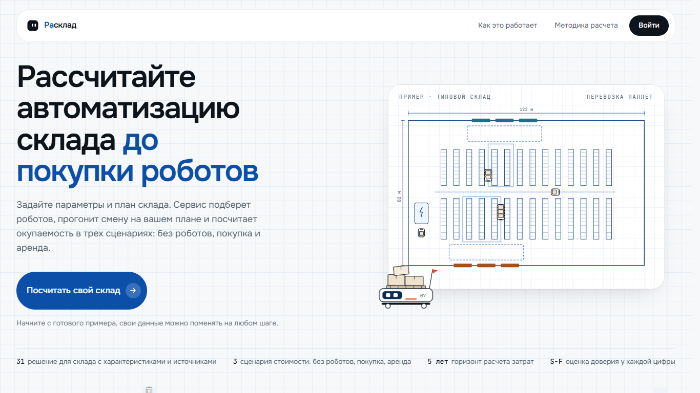

## 6.2. Инструкция по развертыванию и запуску

### Запуск у себя

Нужен Docker с Compose. Интернет для работы сервиса не нужен: все данные лежат в репозитории и попадают в базу при первом запуске.

```bash
cp .env.example .env
docker compose up --build
```

Поднимаются три контейнера: `db` (PostgreSQL 16), `backend` (FastAPI на порту 8000) и `frontend` (порт 3000). При первом запуске сервер сам применяет миграции, кладет в базу каталог на 190 позиций, нормативы по умолчанию и два демо-аккаунта.

| Адрес | Что там |
|---|---|
| http://localhost:3000 | Интерфейс, лендинг |
| http://localhost:3000/calc | Расчет без входа |
| http://localhost:3000/login | Вход по почте и паролю, включая демо-аккаунты |
| http://localhost:3000/method | Как мы считаем, методика картинками |
| http://localhost:8000/api/docs | Описание API (OpenAPI) |
| http://localhost:8000/api/db | Служебные таблицы администратора |

Вернуть демо-проекты и каталог в исходный вид:

```bash
docker compose exec backend python -m scripts.reset_demo
```

### Если Docker Desktop не стартует

На части машин с Windows Docker Desktop падает с ошибкой про файл сокета. Запасной путь: Docker внутри WSL, команды в README.

### Стенд в интернете

Основной способ проверки это запуск у себя, описанный выше. Если нужен показ по ссылке, есть вторая сборка, `docker-compose.stand.yml`: она добавляет https, пароль на весь сайт и выключает демо-вход без пароля. Как ее поднять на сервере, написано в `docs/stand.md`. Наш стенд: https://rasklad-robots.ru, сайт закрыт общим логином и паролем, демо-вход без пароля выключен. Логин и пароль стенда и демо-аккаунтов на нем в материалах сдачи, в репозиторий их не кладем (`docs/security.md`).

### Разработка без Docker

Бэкенд на Python 3.12:

```bash
cd backend
pip install -e ".[dev]"
pytest
uvicorn app.main:app --reload
```

Фронтенд на Node.js 24:

```bash
cd frontend
npm install
npm run dev
```

### Проверки

На каждый pull request GitHub Actions запускает тесты и ruff бэкенда, линт, тесты, формат и сборку фронтенда, сборку образов Docker. Руками то же самое: `pytest` в `backend`, `npm run lint`, `npm test` и `npm run build` во `frontend`.

## 6.3. Архитектура, компоненты, структура данных, API

### Схема

```
Браузер (React)  ->  backend (FastAPI)  ->  PostgreSQL
  мастер, чертеж,       api/ -> services/ -> engine/
  проигрыватель         reports/ (PDF, Excel)
  смены, кабинет,       storage/ (таблицы)
  админка               config/ (нормативы с источниками)
```

Клиент и сервер разделены. Все формулы живут только на сервере, в `backend/app/engine`: браузер получает готовый результат и рисует его. Так цифры на экране, в отчете PDF и в Excel всегда одни и те же.

### Стек

| Часть | Что берем | Почему |
|---|---|---|
| Бэкенд | Python 3.12, FastAPI, Pydantic 2 | Типы данных и описание API получаем сразу |
| Прогон смены | SimPy | Готовая библиотека дискретно-событийной симуляции |
| База | PostgreSQL 16, SQLAlchemy 2, Alembic | СУБД по ТЗ, работа при 50 пользователях одновременно |
| Служебные таблицы | SQLAdmin | Формы по моделям базы для администратора |
| Импорт и экспорт | openpyxl, reportlab | Excel и CSV на входе, отчет PDF и таблицы Excel на выходе |
| Вход | почта и пароль, JWT в httpOnly-cookie, argon2 | Без внешних сервисов входа |
| Фронтенд | React 19, TypeScript, Vite | Свой набор компонентов в `frontend/src/ui` |
| Редактор плана | SVG | Перетаскивание, прилипание, размерные линии |
| Проигрыватель смены | Canvas 2D | Десятки роботов и тепловая карта |

### Компоненты бэкенда

| Папка | Что делает |
|---|---|
| `app/api/` | Прием запросов и вызов сервисов, без логики |
| `app/services/` | Сценарии: собрать расчет, подбор, каталог, нормативы, проекты, бюджет, обновления каталога |
| `app/engine/economics/` | Штат, парк, сценарии, финансирование, выход на режим, показатели |
| `app/engine/plan.py` | План объекта: шаблоны, сетка, ряды, маршрут |
| `app/engine/simulation.py` | Прогон смены: лог отрезками и кривая пропускной способности |
| `app/engine/selection.py` | Правила подбора и объяснение балла |
| `app/engine/readiness.py` | Что подготовить на складе |
| `app/reports/` | Отчет PDF и таблицы Excel |
| `app/storage/` | Таблицы базы |
| `app/auth/` | Вход, роли, демо-аккаунты |
| `migrations/` | Миграции Alembic `0001`-`0008` |
| `scripts/` | Подготовка базы, возврат демо-данных, стенды проверки |

В `engine/` только расчет, без базы, файлов и веба. Содержательных чисел в коде нет: все коэффициенты берутся из `config/` вместе с источником.

### Компоненты фронтенда

| Папка | Что делает |
|---|---|
| `src/main.tsx` | Страницы по адресу, свой разбор адреса, шаг мастера в адресе |
| `src/api/` | Типы, сгенерированные из описания API (`npm run api:types`), и запросы |
| `src/app/` | Мастер: шаги, чертеж плана, смена на плане, сохранение |
| `src/features/` | Лендинг, вход, главные экраны, кабинет, админка, методика |
| `src/ui/` | Набор компонентов, токены, шрифты, роботы |

### Как идут данные

1. Пользователь вводит параметры объекта и штат.
2. `POST /api/plan/generate` строит план по шаблону, каждая правка плана уходит в `POST /api/plan/measure`. Длину маршрута и площади считает сервер.
3. `GET /api/catalog/solutions` подбирает решения под объект и план: ширину проезда, верхний ярус, пандусы.
4. `POST /api/simulation/runs` прогоняет смену и возвращает лог и кривую "сколько роботов, столько операций в час". Кривая кешируется по объекту, задаче, роботу и отпечатку плана.
5. `POST /api/calculations/preview` считает экономику по кривой, плану, штату и сценариям.
6. Интерфейс рисует готовый результат.

### Структура данных

| Данные | Где | Формат |
|---|---|---|
| Нормативы, профили объектов, задачи, расчетные параметры роботов | `config/model.yaml` | значение, источник, дата, оценка доверия |
| Шаблоны планировки, размеры стеллажей, проездов, ворот | `config/layouts.yaml` | то же |
| Поля формы с границами из датасета | `config/parameters.yaml` | путь, единица, границы, подсказка |
| Какие нормативы открыты администратору | `config/norms.yaml` | шаблон пути, раздел, границы |
| Правки нормативов | таблицы `norm_overrides`, `norm_changes` | значение, источник, дата, оценка, кто и когда |
| Каталог решений | таблицы `solutions`, `solution_specs`, `solution_uses`, `solution_photos`, `catalog_changes`, `spec_checks` | решение, характеристики с источниками, задачи объекта, журнал |
| Найденные значения характеристик | `data/specs/sources.csv`, `specs.csv` | одна строка на значение со ссылкой и цитатой |
| Пользователи и проекты | таблицы `users`, `projects`, `project_versions`, `project_files`, `folders`, `shares` | версия хранит снимок ввода, результат, версию модели и версию данных |

Каталог лежит в базе, расчетные параметры робота (скорость, батарея, зарядка, обслуживание) в `config/model.yaml`, связь по номеру решения. Цену для экономики расчет берет из каталога. Сервер держит прочитанный каталог в памяти и сбрасывает его после любой записи в таблицы каталога, поэтому правка в админке сразу видна в подборе. Правки нормативов накладываются поверх файла модели при каждом чтении.

Каждая сохраненная версия несет `model_version` и `data_version`: версия данных складывается из отпечатка файлов конфигурации, правок нормативов и состояния каталога. По ним расчет можно повторить (ТЗ, п. 3.1.5).

Деньги храним в рублях и округляем только при показе. Единица видна в названии поля: `_rub`, `_months`, `_ops_per_hour`.

### API

Полное описание со всеми полями ответа открывается на `/api/docs`. Главные группы:

| Метод | Путь | Что делает | Доступ |
|---|---|---|---|
| GET | `/api/catalog/facilities`, `/operations`, `/parameters` | Объекты, задачи, поля формы с границами и источниками | все |
| GET | `/api/catalog/solutions?facility=` | Подбор решений с объяснением | все |
| GET, POST | `/api/staff`, `/api/staff/check` | Штат по умолчанию, проверка штата | все |
| GET, POST | `/api/plan/templates`, `/generate`, `/measure` | Шаблоны, построение и промер плана | все |
| POST | `/api/simulation/runs`, `/api/simulation/log.csv` | Прогон смены, журнал событий CSV | все |
| POST | `/api/calculations/preview` | Расчет без сохранения | все |
| POST | `/api/calculations/sensitivity`, `/sensitivity/all` | Что будет, если | все |
| POST | `/api/budget/fit` | Сколько роботов влезает в бюджет; без бюджета парк по формуле для предупреждения о пике | все |
| POST | `/api/readiness` | Что подготовить на складе | все |
| POST | `/api/reports/pdf`, `/api/reports/xlsx` | Отчет PDF и таблицы Excel | все |
| POST | `/api/import/template`, `/api/import` | Шаблон и разбор Excel или CSV с данными объекта | все |
| POST | `/api/auth/register`, `/login`, `/logout`, `/demo` | Регистрация, вход, демо-вход | все |
| GET, POST, PATCH, DELETE | `/api/projects`, `/{id}`, `/{id}/versions`, `/{id}/copy`, `/{id}/files` | Проекты, версии, копии, файлы | пользователь |
| GET | `/api/projects/compare` | Сравнение проектов и версий | пользователь |
| POST, GET | `/api/projects/{id}/shares`, `/api/share/{token}` | Ссылка на версию только для просмотра | владелец, все |
| GET, POST, PATCH, DELETE | `/api/admin/catalog`, `/{id}`, `/{id}/specs` | Каталог решений и характеристики | администратор |
| POST, GET | `/api/admin/catalog/import`, `/export`, `/tree`, `/changes` | Загрузка и выгрузка каталога, дерево, журнал | администратор |
| GET, POST | `/api/admin/updates`, `/run`, `/{id}/accept`, `/{id}/reject` | Проверка обновлений на сайтах производителей | администратор |
| GET, PUT, DELETE | `/api/admin/norms`, `/{путь}`, `/changes`, `/export`, `/import` | Нормативы и их журнал | администратор |
| GET | `/api/admin/stats` | Графики главной администратора | администратор |
| GET | `/api/health` | Сервер и база живы | все |

Типы фронтенда генерируются из описания API. Если поле на сервере поменялось, фронтенд не соберется, пока его не поправят.

### Роли и защита

Гость считает и скачивает отчет без входа. Пользователь видит только свои проекты, чужой проект не открывается. Администратор ведет каталог и нормативы и не видит чужие проекты. Пароли хранятся хешем argon2, сессия в httpOnly-cookie. Перед сдачей сервис прошел проверку безопасности, находки и что закрыто, в `docs/security.md`.

## 6.4. Алгоритм подбора и ранжирования решений

Подбор отвечает на три вопроса ТЗ (п. 3.4): почему решение подходит, что мешает и каких данных не хватает. Код в `backend/app/engine/selection.py`, веса в `config/model.yaml`, раздел `selection`.

### Откуда берутся кандидаты

В подбор идут решения каталога, у которых задача объекта подтверждена администратором: например, "склад, перевозка паллет между зонами". Новые позиции из выгрузки организатора получают предложенные задачи и ждут подтверждения в админке.

### Правила проверки

Каждое правило дает один из трех исходов: подходит, не подходит, неизвестно.

| Правило | С чем сравниваем | Исход |
|---|---|---|
| Процесс | Задача решения по нашей разметке, иначе сценарий из каталога организатора | другая задача: не подходит; задача размечена с пометкой "требует проверки": неизвестно |
| Грузоподъемность | Масса груза с шага параметров | меньше груза: не подходит; не опубликована или указана линейкой моделей: неизвестно |
| Ширина прохода | Проезд на плане | шире проезда: не подходит; не опубликована: неизвестно |
| Высота подъема | Верхний ярус стеллажей на плане, только для штабелеров | не достает: неизвестно, верхние ярусы остаются людям |
| Пандус | Пандусы на плане, только для мобильных роботов | уклон никто не публикует: неизвестно |
| Тип стеллажей | Набивные или мобильные стеллажи на плане | работа с торца блока: неизвестно |
| Зрелость | Статус в каталоге | эксплуатация или пилот, пилот снижает балл |

Правила высоты, пандусов и стеллажей работают, когда есть план: без него этих чисел нет. Масса груза по умолчанию 800 кг из датасета организатора.

### Три группы выдачи

- Подходит: ни одно правило не нарушено и все известно.
- Требует проверки: нарушений нет, но хотя бы одно правило вернуло "неизвестно".
- Не подходит: нарушено хотя бы одно ключевое ограничение. Такое решение не рекомендуется, но его можно "все равно посчитать" с предупреждением.

### Балл

Внутри группы решения сортируются по баллу от 0 до 1. Балл это сумма пяти слагаемых, у каждого на экране видно, сколько оно добавило и почему.

| Слагаемое | Вес | Как считаем |
|---|---|---|
| Подходит процессу | 0,30 | весь вес, если процесс подходит |
| Зрелость решения | 0,20 | весь вес при эксплуатации, половина при пилоте |
| Независимая проверка | 0,15 | весь вес при отметке "Протестировано ФЦ БАС", половина при записи в реестре 719 |
| Качество данных | 0,20 | вес * доля ключевых характеристик с оценкой A, B или C |
| Запас грузоподъемности | 0,15 | вес * min(грузоподъемность / груз, 2) / 2 |

Ключевые характеристики: грузоподъемность, минимальная ширина прохода, максимальная скорость, время работы, время зарядки, производительность. Порядок выдачи: сначала подходящие, потом требующие проверки, потом неподходящие, внутри группы по убыванию балла.

Почему так, а не машинное обучение: реальных данных о внедрениях для обучения нет, а правила и веса можно проверить руками и объяснить заказчику.

### Бюджет и второе решение

На шаге решения можно задать бюджет на старте. Сервис подбирает самый большой парк, чьи вложения со всеми статьями не больше бюджета, и прогоняет смену с этим парком, чтобы показать долю спроса, которую он вытянет (раздел 6.5, "Бюджет на старте"). На задачу можно взять два разных решения с долей объема: под кнопкой "Выбрать" у карточки стоит "Сравнить", а у выбранного решения ссылка "взять вторым к этой задаче", объем задачи тогда делится между двумя решениями.

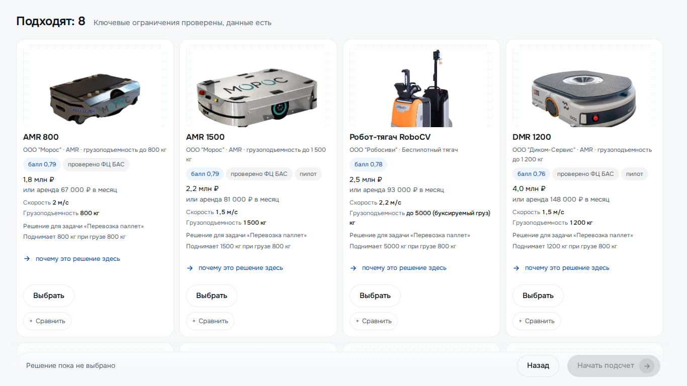

### Предупреждение о пике до прогона

Прогон смены идет до полуминуты, поэтому карточка заранее предупреждает, если решение может не покрыть пик задачи. Предупреждение строится только по тому, что уже есть на шаге решения: плану и парку по формуле (та же точка, что считает бюджет). Случаев три:

- отбор "товар к человеку" на плане с рядами под погрузчик: до станций отбора далеко, карточка предлагает перейти на робозону;
- по формуле нужно больше роботов, чем проверяет прогон смены (250);
- по формуле спрос не вытянуть никаким парком.

Предупреждение не запрещает выбор: точный ответ дает прогон смены. Чтобы отбор не упирался в план, типовая планировка по умолчанию зависит от задач: под "товар к человеку" робозона со станциями, иначе ряды с одной стороны. Схему, которую выбрал человек, сервис не меняет.

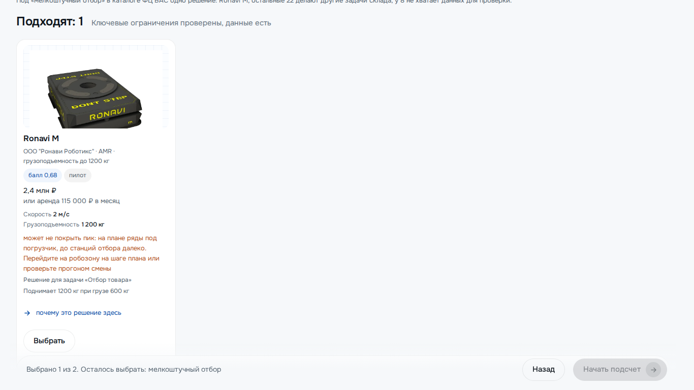

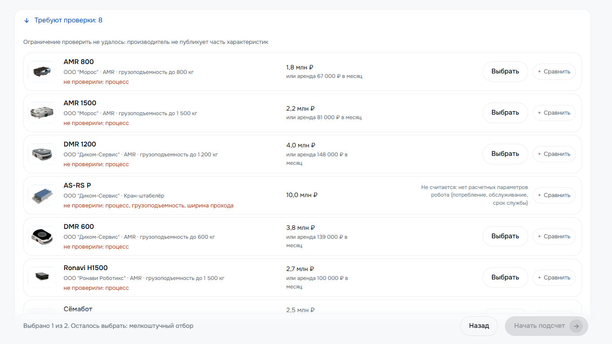

## 6.5. Экономическая модель

Полная методика с примерами руками в `docs/calculation.md`, картинками на странице `/method`. Код в `backend/app/engine/economics/`, значения в `config/model.yaml`.

### Из чего исходим

1. У каждой цифры есть источник и оценка доверия от S до F (раздел 6.6). Оценки E и F означают, что на цифру нельзя опираться, такие места мы называем вслух.
2. Производительность из брошюры напрямую не берем: считаем цикл по маршруту, а парк проверяем прогоном смены.
3. Сравниваем с вариантом "ничего не делать", то есть с затратами на людей, которые сейчас делают эту работу.
4. Сотрудник стоит не только оклад: взносы, травматизм, спецодежда, подбор взамен ушедших. Отпуска и болезни учитываем в числе ставок.
5. Годы целиком: вложения в год 0, затраты и эффект в конце каждого года 1..H. Горизонт 5 лет.
6. Налог на прибыль и НДС не учитываем. Цены каталога организатора с НДС.

Сценарии из ТЗ: без роботизации, покупка, роботы как услуга (аренда с выкупом).

### Единицы

Деньги в рублях с НДС в ценах года расчета, объемы в операциях (паллетах, строках, квадратных метрах уборки) в сутки и в час, время в часах, люди в ставках (полная ставка 1972 часа в год) и в людях в смене, площадь в м2, расстояния в метрах, скорость в м/с.

### 1. Сколько нужно роботов

```
часов в сутки = смен * часов в смене
пиковый спрос = объем в сутки * доля для роботов / часов в сутки * пиковый коэффициент
спрос с резервом = пиковый спрос * (1 + резерв на пик)
маршрут = средний путь по плану, без плана 0.75 * корень(площадь зоны)
производительность робота = 3600 / (2 * маршрут / средняя скорость + погрузка и выгрузка) * операций за рейс
                           (или номинал рейсов в час, если он есть для такой работы)
с учетом загрузки = производительность робота * коэффициент загрузки
парк по формуле = минимальное N, при котором N * производительность с учетом загрузки >= спрос с резервом
зарядных станций = ceil(парк / роботов на станцию)
```

Уборка считается иначе, у нее нет пикового часа: площадь смены известна с утра. Задача с признаком `steady` в конфиге считается под средний час без пикового коэффициента, с тем же резервом 15%, а прогон раскладывает участки ровно по смене. На складе датасета это один Клинботикс 400 PRO, он моет почти до конца смены.

Основной парк берется по прогону смены: роботы едут по плану, стоят в очередях у ворот и в проездах, заряжаются. Берем самый маленький парк, который вытянул спрос при трех разных seed. Формула стоит рядом проверкой. Если и 250 роботов не тянут спрос, расчет пишет, что парк не покрывает пик, и называет задачу, решение и причину. Причина в плане, если на нем нет стеллажей, до которых робот доезжает, или у отбора "товар к человеку" нет станций: тогда шаг экономики ведет обратно к плану. Иначе причина в решении, и шаг ведет к выбору другого решения.

У отбора "товар к человеку" рейс робота это подача стеллажа к станции, за подачу отборщик снимает в среднем 1,9 строки. Прогон смены засчитывает рейсу столько же строк.

### 2. Люди

```
ставок на круглосуточный пост = часов в сутки * дней в году / норма часов * (1 + потери рабочего времени)
постов операторов = max(минимум дежурных, ceil(парк * минут внимания на робота в час / 60))
операторы роботов = постов * ставок на пост
ставок до = заменяем человек * доля для роботов * рост объема (или по выработке, если она меньше)
ставок до у отбора товара = объем для роботов в год / (выработка человека * норма часов) * (1 + потери)
ставок после = ставок до * выработка до / выработка на станции, если человек остается на операции, иначе 0
высвобождается = ставок до - ставок после
переучиваем = min(операторы роботов, высвобождается)
```

Полная стоимость ставки в год:

```
оклад за год = оклад в месяц * 12
взносы = min(оклад за год, предельная база) * 30% + max(оклад за год - предельная база, 0) * 15.1%
полная стоимость = оклад за год + взносы + оклад за год * травматизм + спецодежда + текучесть * подбор
```

Людей на отборе товара считаем от объема, а не долей от штата: 100 отборщиков датасета при выработке 80 строк в час не закрывают и трети его же объема, и доля от штата занижала ручную работу втрое. Почему так, в `docs/decisions.md`, раздел "Отбор товара: цифры датасета проверяем, люди от объема".

Оператором роботов становится тот же сотрудник, которого заменяем: платим как той роли плюс надбавка, по умолчанию ноль. Если операторов нужно больше, чем высвободилось, расчет пишет, скольких не хватает, но найм с рынка не закладывает: рыночной ставки оператора складских роботов мы не нашли (`docs/calculation.md`, раздел 2).

Закрытые вакансии в деньги не идут. В затраты "без роботов", в экономию, в выход на режим и в "Что будет, если" попадают только занятые ставки, то есть живые люди. Работу на вакансиях роботы делают: парк считается от объема, а закрытые вакансии видны отдельной строкой. В демо-расчете вакансий нет, его числа от этого не меняются.

### 3. Вложения на старте (CAPEX, год 0)

| Статья | Покупка | Аренда |
|---|---|---|
| Роботы | парк * цена | входят в плату |
| Зарядные станции | станций * цена | входят в плату |
| ПО управления парком | разово, один раз на производителя | входит в плату |
| Станции комплектации | станций * цена | станций * цена |
| Интеграция с WMS | по объекту | по объекту |
| Инфраструктура | по объекту | по объекту |
| Пусконаладка | парк * цена * доля | парк * цена * доля |
| Переобучение операторов | ставок * курс | ставок * курс |
| Резерв | 10% от суммы статей | 10% от суммы статей |

### 4. Затраты по годам (OPEX)

Индексы года t: зарплаты `(1 + рост зарплат)^(t-1)`, электроэнергия `(1 + рост тарифа)^(t-1)`, остальное `(1 + инфляция)^(t-1)`.

| Статья | Как считаем | Покупка | Аренда до выкупа |
|---|---|---|---|
| Люди без роботов | ставок до * стоимость * индекс | база сравнения | база сравнения |
| Люди после роботов | ставок после * стоимость * индекс | да | да |
| Электроэнергия | парк * кВт * часов работы * тариф * индекс | да | да |
| Связь | в год * индекс | да | да |
| Операторы роботов | ставок * стоимость * индекс | да | за вычетом доли поставщика |
| ТО и ремонт | парк * цена * доля * индекс | да | в плате |
| Лицензии ПО | парк * лицензия * индекс | да | в плате |
| Замена АКБ | парк * цена АКБ * индекс в год, кратный ресурсу | да | в плате |
| Плата за аренду | парк * плата в месяц * 12 | нет | да |
| Ответственность за порчу | парк * цена * доля * индекс | нет | да |

```
годовой эффект = люди без роботов - люди после роботов - OPEX роботов
денежный поток = годовой эффект - вложения в этом году (выкуп, обновление парка)
```

Аренда: плата фиксированная за робота в месяц, в конце контракта выкуп по остаточной стоимости `парк * цена * max(0, 1 - срок контракта / срок службы)`, после выкупа затраты как при покупке. Если срок службы кончается ровно к выкупу, в год выкупа парк обновляется, как при покупке. Платежи по годам, что входит в плату и как считается эффект, подробно в разделе "Что мы прорабатывали сами", пункт 4.

### 5. Показатели

```
простой срок окупаемости (ТЗ) = CAPEX / годовой эффект первого года
окупаемость по потоку = год, когда -CAPEX + сумма денежных потоков >= 0, с долей года
ROI по ТЗ = сумма годовых эффектов / вложения за горизонт
чистый ROI = (сумма эффектов - вложения за горизонт) / вложения за горизонт
TCO = вложения за горизонт + сумма (люди после роботов + OPEX роботов)
амортизация = линейно, CAPEX / срок службы
NPV = -CAPEX + сумма [денежный поток / (1 + ставка)^t]
IRR = ставка, при которой NPV = 0
```

Вывод даем не по жесткому порогу, а числом, интервалом окупаемости (до 3 лет, 3-5 лет, более 5 лет, не окупается), списком рисков и текстом. Проверка для себя: `TCO без роботов - TCO сценария = сумма эффектов - вложения за горизонт`.

Если сценарий за горизонт не окупается, сервер досчитывает его на 10 лет тем же парком с заменой изношенных роботов и пишет под ответом, на каком году вернутся вложения, или что и за 10 лет не окупится. Главные цифры остаются за горизонт расчета.

### 6. Что еще учитывает модель

- Несколько задач на объекте: общее на объект (дежурные, интеграция, инфраструктура, ПО по разу на производителя, связь) считается один раз, от порядка задач итог не зависит.
- Кредит, лизинг и господдержка: способ оплаты меняет только покупку. Окупаемость в кредит считается с учетом остатка долга, показываем покрытие долга. Три меры поддержки для склада проверены по первоисточникам, недоступная мера показана с причиной. Неверные условия оплаты расчет не ломают: сервер их не берет, покупку считает за свои деньги и говорит, какое поле поправить.
- Выход на режим: первые месяцы эффект неполный, потеря ложится в затраты на людей первого года. Для перевозки и уборки первый месяц 70%, для "товар к человеку" 20% и полный эффект за 5 месяцев. Числа наши, оценка F, пользователь их правит.
- Бюджет на старте: сколько роботов влезает со всеми вложениями и какую долю спроса они вытянут за смену.
- Что будет, если: четыре главных числа сдвигаются на -20, -10, +10, +20%, по кнопке так же сдвигается каждое число расчета, список сортируется по размаху выгоды за горизонт.
- Проверка чисел робота, которые правит пользователь: срок службы робота и аккумулятора, роботов на зарядку и срок договора аренды приводятся к целым, ноль скорости или роботов на зарядку расчет не принимает. Отказ называет поле, а шаг экономики предлагает вернуть числа робота как было. Цена 0 в каталоге значит "цена не указана", расчет тогда берет цену модели.

### Главные значения и источники

| Значение | По умолчанию | Источник | Оценка |
|---|---|---|---|
| Норма часов на ставку | 1972 ч в год | Производственный календарь 2026 | S |
| Страховые взносы | 30%, сверх базы 15,1% | НК РФ ст. 425 | S |
| Предельная база взносов | 2 979 000 ₽ | Постановление Правительства на 2026 | S |
| Травматизм | 0,6% | ОКВЭД 52.10, 5 класс, приказ Минтруда 851н | S |
| Потери рабочего времени | 25% | Датасет организатора | D |
| Резерв на пик | 15% | Датасет организатора, лист "Легенда" | D |
| Загрузка AMR | 75% (70-85%) | Датасет организатора, лист "Легенда" | D |
| Резерв CAPEX | 10% | Датасет организатора, лист "Легенда" | D |
| Горизонт | 5 лет | Датасет организатора, лист "Склад" | D |
| Ставка дисконтирования | 14% | Ключевая ставка ЦБ 11.09.2026 | C |
| Рост зарплат | 7% в год | Сценарные условия Минэкономразвития 2027-2029 | C |
| Рост тарифа на электроэнергию | 9% в год | Там же | C |
| Инфляция | 4% в год | Прогноз ЦБ и Минэкономразвития | C |
| Цена Ronavi H1500 | 2,7 млн ₽ | Каталог организатора, у производителя 2,16-2,7 млн | B |
| Зарядная станция | 450 000 ₽ | Ronavi, сверено с MiR и Omron | C |
| Аренда Ronavi H1500 | 100 000 ₽ в месяц | Пресс-релиз РОСНАНО 2019 года, без индексации | D |
| ТО и ремонт | 10% цены робота в год | Ronavi | C |
| Срок службы робота | 5 лет | Классификация основных средств, 3 группа | C |
| Выработка отборщика вручную | 80 строк в час | Нижняя граница датасета, сверена с маршрутом 25 м на строку | D |
| Выработка на станции отбора | 250 строк в час | Яндекс Роботикс 250-300, Kiva 200-250 | C |
| Строк за подачу стеллажа | 1,9 | Симуляция Merschformann и др. (2018) | D |

Остальные значения с источниками открываются в интерфейсе ("Откуда цифры"), в отчете, в админке ("Нормативы") и в `config/model.yaml`. Всего в модели 576 значений: S 13, A 8, B 23, C 110, D 226, E 21, F 175.

### Главные допущения

- Средняя скорость робота 2/3 максимальной, погрузка и выгрузка 20 с.
- Внимание оператора 1,5 минуты на робота в час, минимум один дежурный в смену. Сколько на деле, никто не публикует.
- Типовой план "с одной стороны", если человек не чертил свой: пропорция здания и глубина зон наши, оценка F.
- Интеграция 5 млн ₽ и инфраструктура 3 млн ₽ на объект, пусконаладка 10% цены робота: производители не публикуют, оценка F.
- Остаточную стоимость роботов в конце горизонта не учитываем, так расчет осторожнее.
- Отбор товара: выработка отборщика 80 строк в час вместо базовых 150 датасета, станция 250 строк в час, 1,9 строки за подачу стеллажа. Как проверяли, в разделе "Что мы прорабатывали сами", пункт 3, и в `docs/dataset-check.md`.

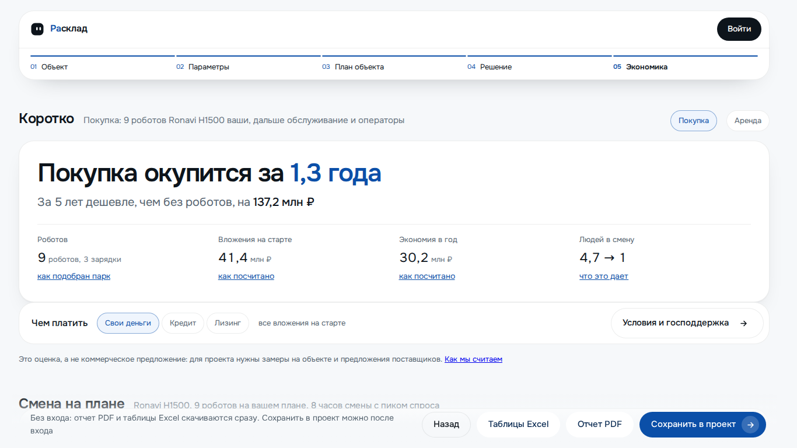

## 6.6. Порядок загрузки и обновления данных

### Что лежит в репозитории и как попадает в базу

| Данные | Файл | Как попадает в работу |
|---|---|---|
| Наши 31 складское решение с характеристиками | `data/catalog/`, `data/specs/` | в базу при первом запуске |
| Выгрузка каталога организатора | файл в материалах сдачи, в репозитории не хранится | администратор загружает файлом в админке (раздел "Каталог решений", кнопка "Загрузить выгрузку"); всего 190 позиций |
| Решения для аэропорта и медучреждения | `data/facilities/` | читаются сервером |
| Нормативы, профили объектов, роботы | `config/model.yaml` | читаются сервером, правки администратора поверх из базы |
| Шаблоны планировки | `config/layouts.yaml` | читаются сервером |
| Поля формы с границами из датасета | `config/parameters.yaml` | читаются сервером |

Подготовку базы делает `scripts.prepare_database` при старте контейнера: применяет миграции, создает демо-аккаунты, заполняет пустой каталог. На заполненной базе повторный запуск ничего не перезаписывает.

### Оценка достоверности

У каждой характеристики и каждого значения модели есть источник, дата, цитата и оценка:

| Оценка | Условие |
|---|---|
| S, эталон | закон, постановление, производственный календарь, ТЗ |
| A, проверено | сходятся организатор и производитель, либо производитель и эксплуатант |
| B, подтверждено | сходятся два разных типа источников |
| C, один источник | только производитель или интегратор |
| D, слабо | только организатор или только СМИ |
| E, спорно | источники расходятся больше чем на 10% |
| F, нет данных | допущение команды с обоснованием |

При расхождении в расчет идет значение организатора, но если актуальная страница производителя дает худшую для окупаемости цифру, берем ее. Правила целиком в `docs/data-sources.md`.

### Данные объекта пользователя

На шаге параметров есть загрузка Excel или CSV по шаблону (`POST /api/import/template` отдает шаблон с текущими значениями). Сервер проверяет типы, единицы, обязательные поля и границы из датасета и возвращает отчет по строкам. Подставляет данные человек, сервер ничего не сохраняет сам.

### Каталог

Администратор загружает выгрузку организатора кнопкой "Загрузить выгрузку" (CSV с разделителем `;`, UTF-8). Есть режим проверки: сначала отчет, что добавится и что поменяется, потом загрузка. Ручные правки администратора повторная загрузка не затирает. Каталог выгружается в том же формате с нашими колонками ("Скачать каталог") и загружается обратно без потерь. Каждая правка пишется в журнал с тем, кто и когда.

### Нормативы

Раздел "Нормативы" в админке показывает 55 открытых значений с источником, датой и оценкой. Правка ложится поверх файла модели и сразу идет в расчет, в "Откуда цифры" и в отчете она подписана "Норматив, правил администратор". Вернуть значение из файла можно одной кнопкой. Нормативы выгружаются в Excel или CSV и загружаются тем же форматом.

### Автообновление характеристик

Кнопка "Проверить обновления" запускает в фоне обход страниц производителей из `data/specs/sources.csv`. Если цифра на странице расходится с каталогом больше чем на 10%, появляется предложение правки со ссылкой и датой. Администратор принимает его с оценкой, по умолчанию C, или отклоняет, решение пишется в журнал. Сайты, которые запрещают автоматический сбор, не открываем. Без интернета проверка идет по сохраненным страницам из `data/specs/saved`.

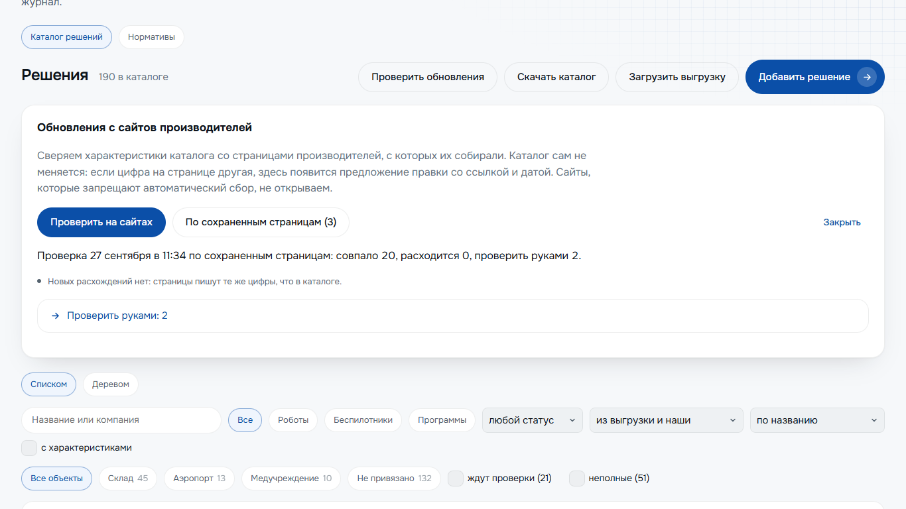

## 6.7. Руководство пользователя и администратора

### Пользователь: расчет за пять шагов

Кнопка "Посчитать свой склад" на лендинге открывает мастер. Пройденный шаг сворачивается в строку с итогом, шаг записан в адресе, введенное хранится в браузере и переживает перезагрузку.

Шаг 1. Объект и задачи. Четыре карточки одного вида в ряд: склад, аэропорт, медучреждение и "Другое" (весь каталог без расчета). Выбранная подсвечена рамкой и стоит на месте. Ниже отметьте работу, которую заберут роботы. На складе это перевозка паллет, отбор и уборка, можно несколько сразу, у каждой задачи виден объем в сутки и откуда цифра.

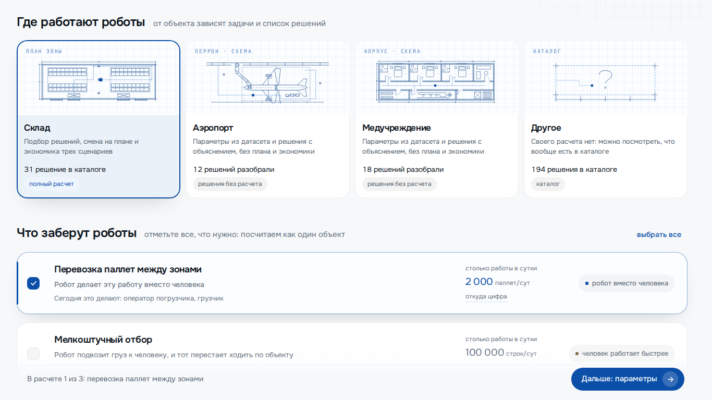

Шаг 2. Параметры. Площадь зоны работы роботов (часть склада, где ездят роботы, в датасете "активная зона"), смены, объемы, масса груза, штат по ролям: мест в штате, сколько из них занято людьми, оклад. Значения по умолчанию уже стоят, главные в плитках с явными полями. У каждого поля единица, подсказка строкой под полем, источник и оценка под буквой. Выход за границы датасета подсвечивается рамкой поля и короткой строкой "обычно от ... до ..." на месте подсказки. Когда выбрана перевозка паллет, масса паллеты с грузом стоит среди главных полей: от нее зависит, какие роботы поднимут груз. Остальные параметры лежат в раскрывающейся строке, там же "Товар разложен по ходовости" с кнопками "Да" и "Нет" (в данных и в Excel это 1 и 0). Параметры можно загрузить из Excel или CSV кнопкой "Загрузить Excel или CSV", шаблон скачивается ссылкой рядом, файлы со старым названием поля площади загрузка тоже узнает.

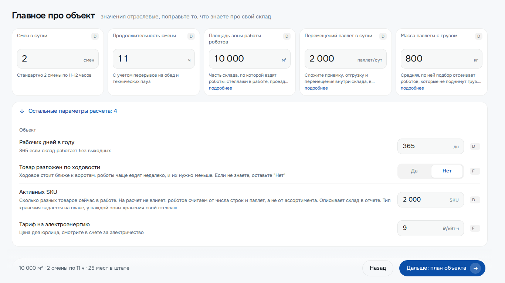

Шаг 3. План объекта. Есть три способа: типовая планировка (сквозной поток, Г-образный, "с одной стороны", робозона), свой склад по ответам на вопросы о воротах и рядах, и план по фото или скану. Любой план потом правится на чертеже на весь экран: контур здания, ряды стеллажей, ворота, проезды, перегородки, пандусы, уровни пола. Зарядки ставит программа. Типовая схема по умолчанию зависит от задач: для отбора "товар к человеку" это робозона со станциями, для остальных ряды с одной стороны. План по фото начинается с пустого здания по контуру с картинки: стеллажи и ворота человек ставит сам. Шаг можно пропустить, тогда расчет возьмет типовую схему и скажет об этом в выводе. Проверки плана идут списком под листом: если проезд между рядами уже 1,2 м, которые мы советуем, шаг предупреждает. На шаге экономики проезд уже минимума выбранного робота останавливает расчет словами, например "Между рядами 0,5 м, а Ronavi H1500 нужно не меньше 0,75 м: раздвиньте ряды", с кнопкой к плану; проезд между минимумом и 1,2 м попадает в риски.

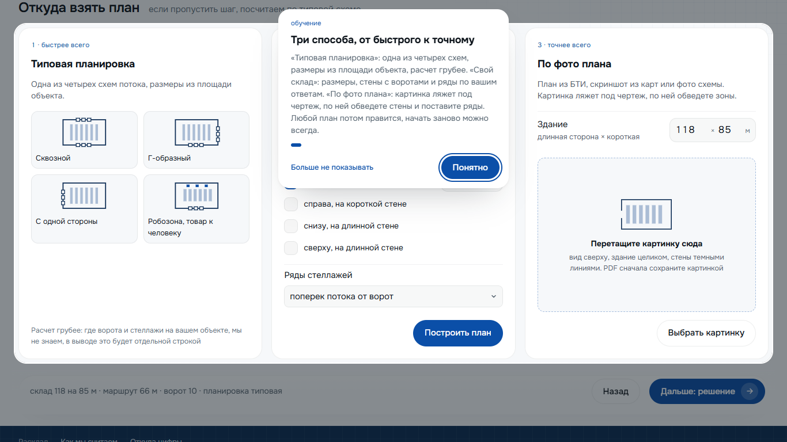

Чертеж учит сам. При первом входе он показывает карточку трех способов, а кнопка "Как пользоваться" в любой момент предлагает два пути: "Основы" (7 шагов: режимы, движение по листу, выбор и отмена, план и объем, числа и проверки) и "Все инструменты" (по шагу на каждую кнопку). После основ идет практика: человек сам ставит ряд, ворота и буфер у ворот и смотрит проверки плана. В основах и в практике есть кнопка "Назад". Шаг засчитывается, когда вещь появилась на листе. Если практика шла на готовом плане, после "Готово" план возвращается таким, каким был. Карточку практики можно свернуть в плашку в углу листа, а когда человек тянет по листу, она сворачивается сама. "Начать заново" после подтверждения сразу стирает начерченное и строит чистый план тем же способом.

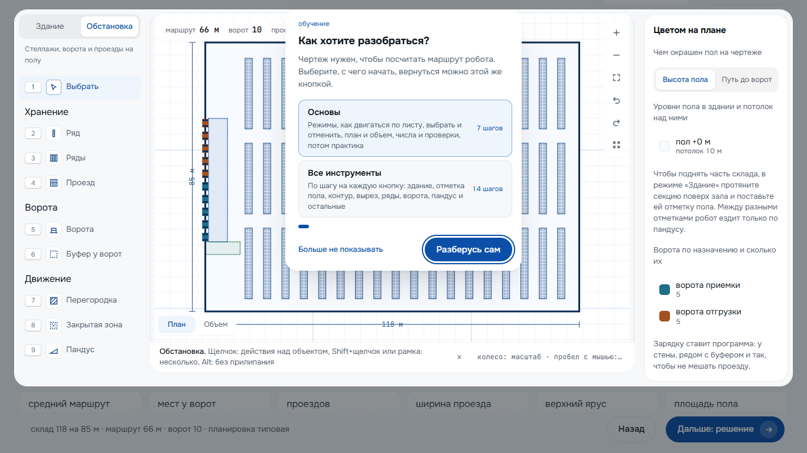

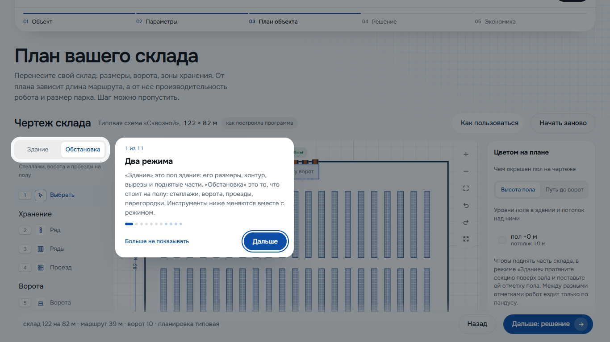

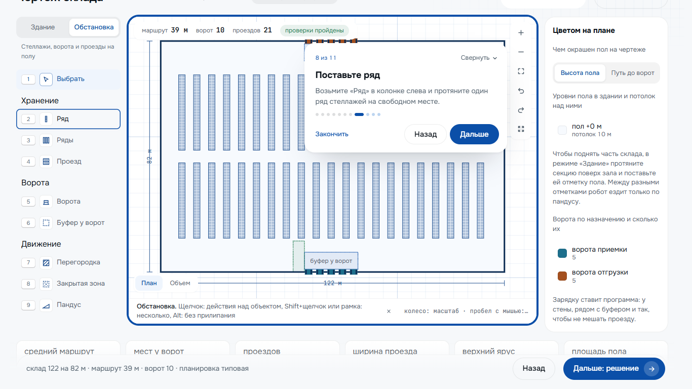

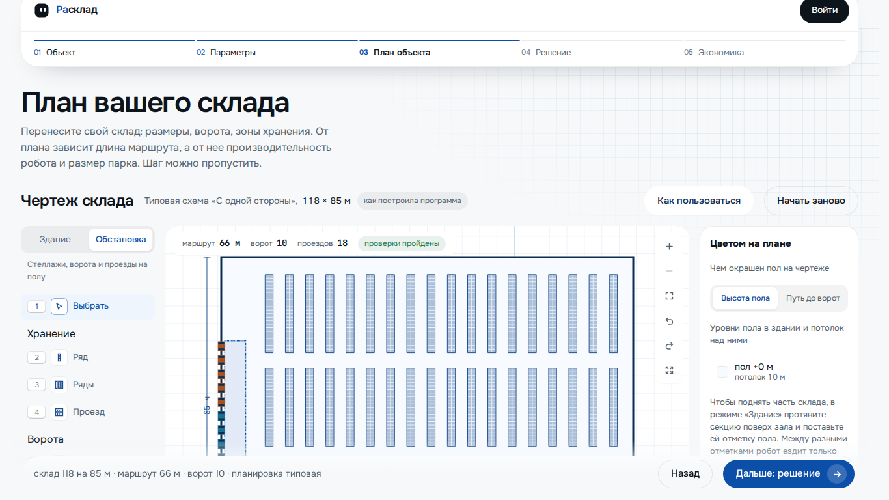

Шаг 4. Решение. Подходящие решения стоят карточками, "требуют проверки" и "не подходят" свернуты. На карточке цена, аренда и строками главные цифры из каталога: скорость, производительность, грузоподъемность, с единицами источника; нет цифры, нет строки. Выдачу можно отсортировать по производительности: это порядок, а не сравнение, единицы у решений разные. Ссылка "почему это решение здесь" раскрывает, почему подходит, что мешает, откуда цифры, а в группе "требуют проверки" написано, что именно не проверили. Если решение может не покрыть пик задачи, карточка предупреждает об этом до прогона смены (раздел 6.4). Под кнопкой "Выбрать" стоит "Сравнить". У выбранного решения ссылка "взять вторым к этой задаче": объем задачи поделится между двумя решениями. Можно задать бюджет на старте. Кнопка "Начать подсчет" запускает расчет, полоса прогресса показывает этапы.

Шаг 5. Экономика. Сверху ответ словами, он же заголовок экрана: "Покупка окупится за 1,3 года", под ним "За 5 лет дешевле, чем без роботов, на 137,2 млн ₽" и четыре числа со ссылками "как посчитано". Сводка всегда открывается покупкой, аренда переключателем рядом. Под ответом строка "Чем платить: Свои деньги / Кредит / Лизинг" и кнопка "Условия и господдержка". Кредит или лизинг открывают панель условий справа: ползунки суммы, ставки и срока (до 7 лет), четыре числа (свои деньги на старте, платеж в месяц, переплата, окупаемость), меры господдержки под выбранный способ и платежи по годам. Ниже оговорка, что это оценка. Сразу под ответом смена на плане, открытая: роботы едут по вашему складу, переключатель "Роботы", "План смены" и "Как прошла смена" меняет то, что нарисовано на плане, строка под ним говорит, что сейчас на плане, справа парк со строкой "9 роботов вытягивают спрос 149 в час, 8 уже не хватает", итоги смены и узкое место. Дальше блоки списком строк: у каждой заголовок, главные числа и кнопка "Подробнее", полный блок раскрывается прямо под строкой, можно открыть несколько. Строки: "Три сценария за 5 лет" (плитки, график накопленных затрат, риски, все показатели ТЗ: окупаемость, ROI, NPV, IRR, деньги по годам), "Куда уходят деньги" (статьи на старте, в год и за 5 лет, выход на режим), "По задачам", если задач несколько, "Что будет, если", "Что подготовить на складе" и "Откуда цифры" (как подобран парк с кривой парка, что мы приняли за вас, источники всех цифр). В блоке "Что мы приняли за вас" можно поправить цену, обслуживание и срок службы робота. Ссылки "как посчитано" сами раскрывают нужный блок. Внизу кнопки "Отчет PDF", "Таблицы Excel" и "Сохранить в проект". Гостю в нижней полосе написано, что PDF и Excel скачиваются без входа, а "Сохранить в проект" открывает окно: войти, зарегистрироваться или не сейчас. Расчет не пропадает: после входа он сразу сохраняется в новый проект.

Если парк не покрывает пик, вместо экономики стоит сообщение с задачей, решением и причиной. Когда причина в плане (нет стеллажей, до которых робот доезжает, или нет станций отбора), кнопка "Вернуться к плану" ведет на шаг 3. Когда в решении, кнопка "Поменять решение" ведет на шаг 4. Если в блоке "Что мы приняли за вас" введено невозможное число робота, отказ называет поле, а кнопка "Вернуть числа робота как было" возвращает значения.

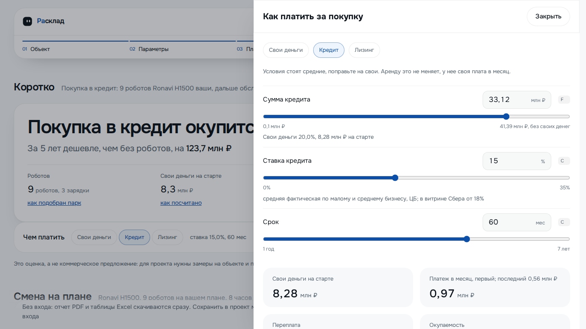

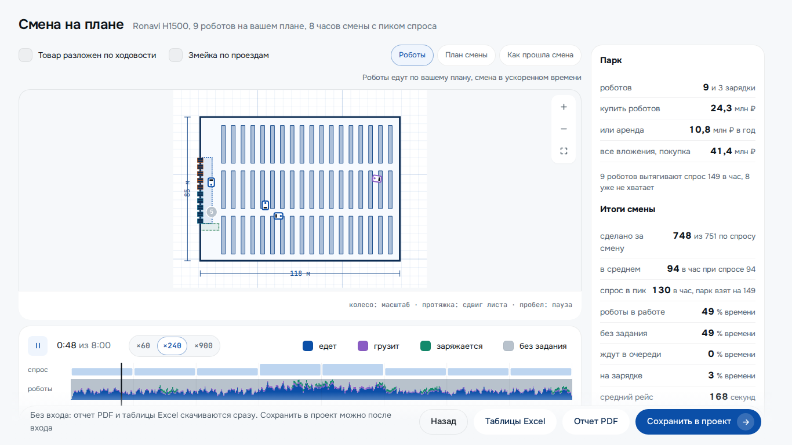

### Пользователь: главная и кабинет

Вход по почте и паролю, регистрация на любую почту вида `ivan@example.com`, писем мы не шлем. После входа человек попадает на свою главную: последний проект с главными числами и планом склада, новое в каталоге, ссылки на методику.

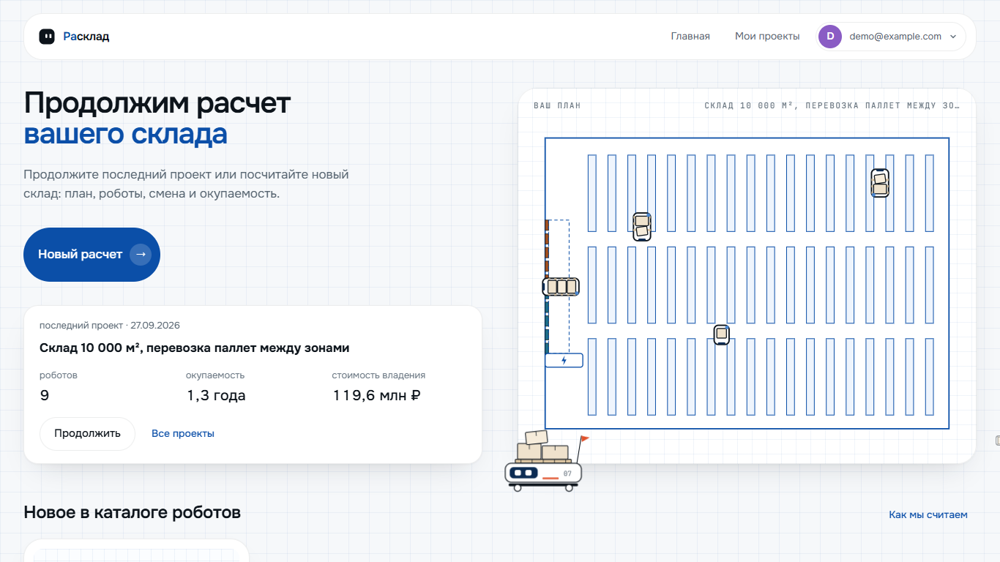

В кабинете ("Мои проекты") проекты с версиями и папками. Каждое сохранение становится новой версией, старые не меняются. Проекты можно открыть в расчете, скопировать как "что будет, если", сравнить рядом, отметив галочками, переложить в папку, удалить. "Поделиться" дает ссылку на версию только для просмотра, ссылку можно отозвать. В меню аккаунта профиль (имя, компания, почта, пароль, удаление аккаунта) и настройки с темной темой.

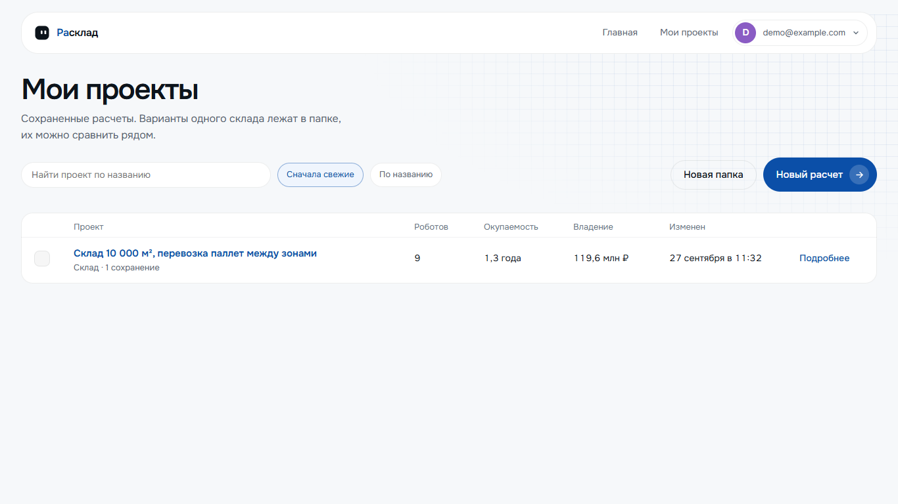

Страница "Как мы считаем" (`/method`) объясняет расчет картинками: путь расчета, парк, сценарии, окупаемость, шкала доверия, что пока не учли.

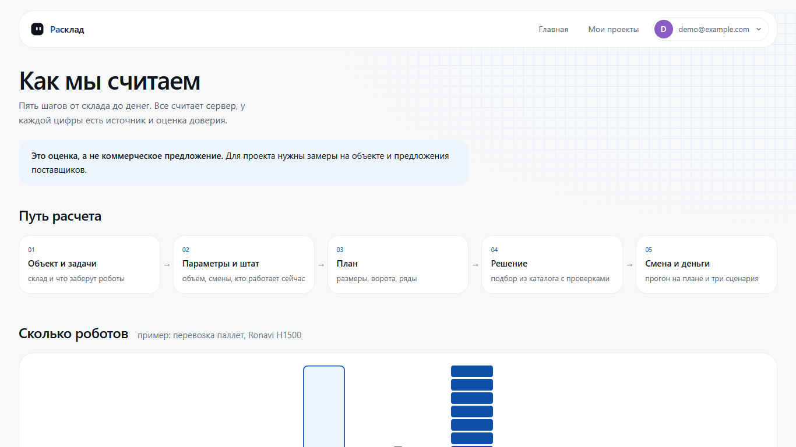

### Администратор

Демо-администратор попадает на свою главную: что ждет решения (подтвердить объекты и задачи новых позиций, правки с сайтов производителей, проверить руками), сколько решений, пользователей и проектов в сервисе, графики по дням (сохранения расчетов, новые пользователи, правки каталога) и журнал правок.

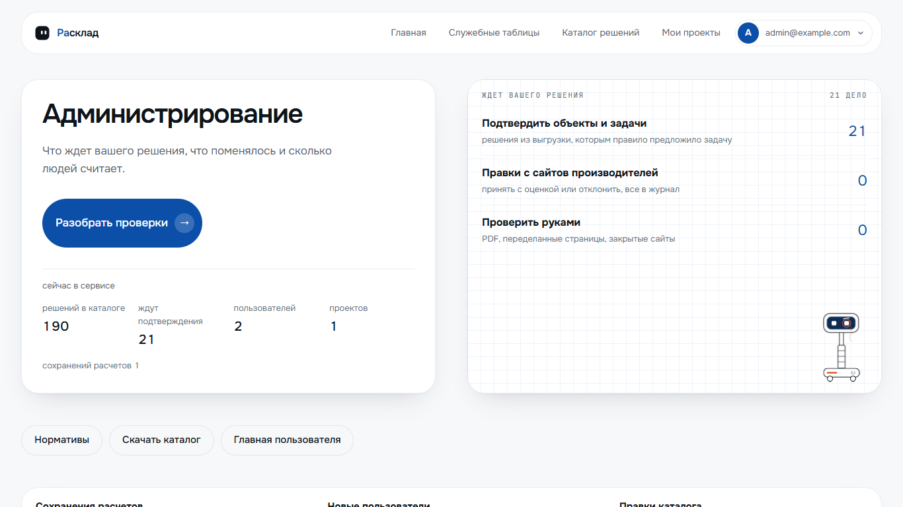

Каталог решений (`/admin`): 190 позиций списком или деревом (отрасль, объект, процесс, тип решения, продукт), поиск, фильтры по типу, статусу, объекту, "ждут проверки" и "неполные". Кнопки "Проверить обновления", "Скачать каталог", "Загрузить выгрузку", "Добавить решение".

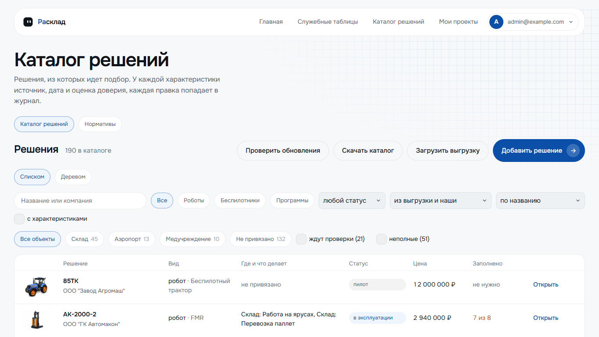

Карточка решения: название, компания, статус, цена, задачи объекта, фото с полями "Откуда фото" и "Чье фото", характеристики. У каждой характеристики значение, единица, источник, цитата, дата и оценка. Правка сразу видна в подборе и пишется в журнал с историей "было и стало".

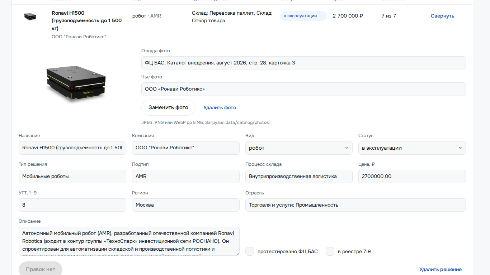

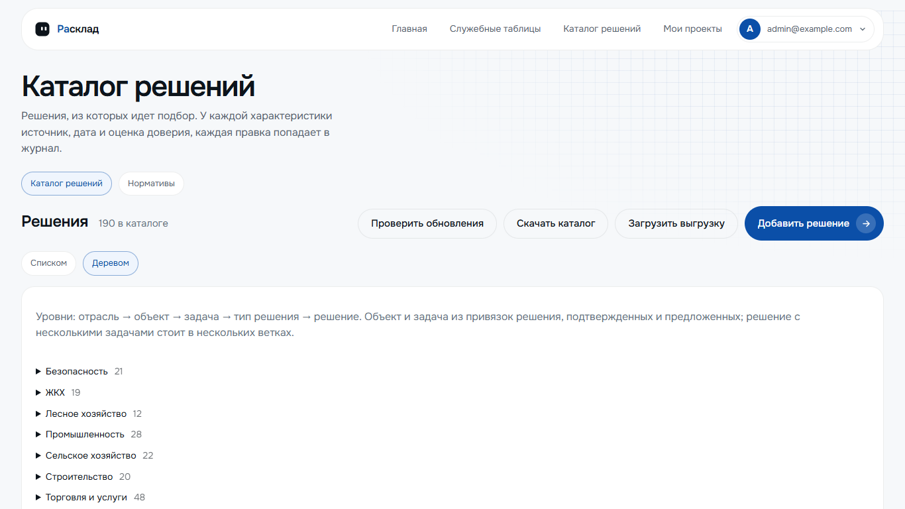

Нормативы (`/admin?tab=norms`): взносы, рабочее время, деньги и цены, резервы, объект по умолчанию, задачи объекта, внедрение. Фильтры "правил администратор" и "без источника, E и F". Кнопки "Скачать нормативы" и "Загрузить файл".

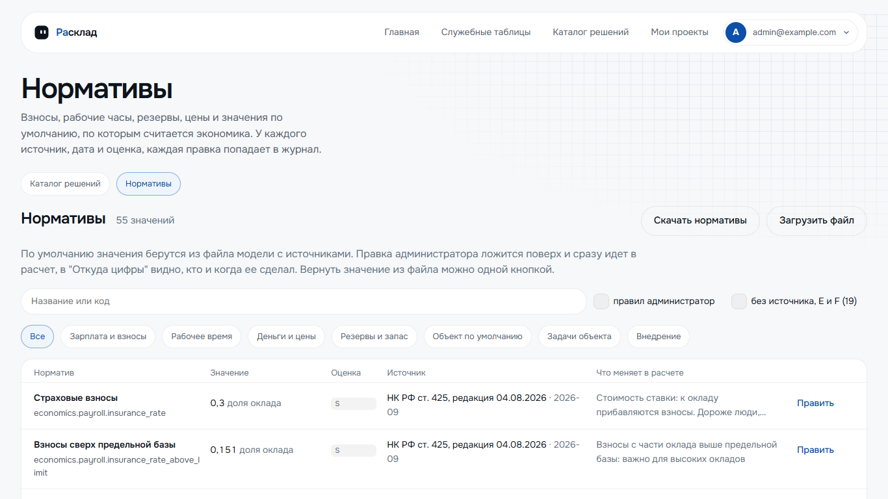

Служебные таблицы (`/api/db`, пункт "Служебные таблицы" в шапке) открываются каталогом: пользователи и журналы. Чужие проекты администратор не открывает.

## 6.8. Внешние библиотеки и источники данных

### Библиотеки бэкенда

| Библиотека | Зачем | Ссылка |
|---|---|---|
| FastAPI | API и описание OpenAPI | https://fastapi.tiangolo.com |
| Uvicorn | Сервер приложения | https://www.uvicorn.org |
| Pydantic, pydantic-settings | Модели данных, настройки из `.env` | https://docs.pydantic.dev |
| SQLAlchemy 2 | Работа с базой | https://www.sqlalchemy.org |
| Alembic | Миграции базы | https://alembic.sqlalchemy.org |
| psycopg 3 | Драйвер PostgreSQL | https://www.psycopg.org |
| SQLAdmin | Служебные таблицы администратора | https://github.com/aminalaee/sqladmin |
| SimPy | Прогон смены | https://simpy.readthedocs.io |
| openpyxl | Чтение и запись Excel | https://openpyxl.readthedocs.io |
| defusedxml | Безопасный разбор XML в файлах Excel | https://github.com/tiran/defusedxml |
| reportlab | Отчет PDF | https://www.reportlab.com |
| PyYAML | Чтение конфигурации | https://pyyaml.org |
| argon2-cffi | Хеши паролей | https://argon2-cffi.readthedocs.io |
| PyJWT | Токен сессии | https://pyjwt.readthedocs.io |
| email-validator | Проверка почты | https://github.com/JoshData/python-email-validator |
| python-multipart | Загрузка файлов | https://github.com/Kludex/python-multipart |
| itsdangerous | Подпись сессии служебных таблиц | https://itsdangerous.palletsprojects.com |
| pytest, httpx, ruff | Тесты и проверки кода | https://pytest.org, https://www.python-httpx.org, https://docs.astral.sh/ruff |

### Библиотеки фронтенда и окружение

| Что | Зачем | Ссылка |
|---|---|---|
| React 19 | Интерфейс | https://react.dev |
| TypeScript | Типы | https://www.typescriptlang.org |
| Vite | Сборка | https://vite.dev |
| openapi-typescript | Типы из описания API | https://openapi-ts.dev |
| ESLint, Prettier | Проверки и формат кода | https://eslint.org, https://prettier.io |
| Шрифты Onest и JetBrains Mono | Текст и цифры, лицензия OFL | https://fonts.google.com/specimen/Onest, https://www.jetbrains.com/lp/mono |
| PostgreSQL 16 | База | https://www.postgresql.org |
| Docker, Compose | Запуск | https://www.docker.com |
| Caddy | https и пароль на стенде | https://caddyserver.com |

Других библиотек интерфейса (роутеров, графиков, наборов компонентов) нет: графики, чертеж и проигрыватель смены написаны сами.

### Данные организатора

- `Датасеты_хакатон.xlsx`: три листа объектов с базовым значением, границами и источником, лист "Легенда" с нормативами.
- `catalog_export_v4.csv`: 223 решения, после склейки дублей по номеру и цене 190 позиций.
- `Примеры_решений_типы_объектов.docx`: характеристики примеров решений и список открытых источников.
- Дополнения к ТЗ и ответы организатора на вопросы участников.

Файлы организатора лежат в закрытом репозитории с разрешения организатора и показываются только закрыто.

### Открытые источники

| Что | Где |
|---|---|
| Характеристики решений | Сайты производителей и интеграторов: ronavi-robotics.ru, waybotrobotics.com, automacon.ru, robotics.yandex.ru, kiit.ru, robob2b.ru, tnvst.ru и другие. Все 1616 найденных значений со ссылкой, цитатой и датой в `data/specs/sources.csv` |
| Цены зарядных станций | ronavi-robotics.ru, shop.gibsonengineering.com (MiR), kingbarcode.com (Omron), курс ЦБ на 25.09.2026 |
| Норма часов | Производственный календарь 2026, consultant.ru/law/ref/calendar/proizvodstvennye/2026/ |
| Взносы | НК РФ ст. 425; травматизм по приказу Минтруда 851н |
| Ставки и прогнозы | cbr.ru (ключевая ставка, ставки по кредитам, прогноз инфляции); сценарные условия Минэкономразвития, garant.ru/products/ipo/prime/doc/414115625/ |
| Кредит и лизинг | sberbank.ru, alfaleasing.ru и сайты лизинговых компаний, alt-invest.ru (покрытие долга) |
| Господдержка | corpmsp.ru (программа 1764), frprf.ru (стандарт ФРП "Лизинговые проекты"), решение Минпромторга о возврате затрат |
| Тариф на электроэнергию | mosenergosbyt.ru |
| Проверка на внедрениях | опубликованные кейсы Восток-Сервиса (Ronavi H1500) и Яндекс Лавки (Яндекс Роботикс) |

Каждое значение модели несет свою ссылку в `config/model.yaml`, в интерфейсе ее видно в "Откуда цифры".

## 6.9. Известные ограничения и план развития

### Ограничения модели и данных

- Штучный отбор "товар к человеку" всегда считается по компактной робозоне (часть склада по ползунку "Под отбор роботами"), какой бы план ни начертил человек: на рядах под погрузчик до станций в разы дальше, и парк не сходится. Остальные задачи считаются по его плану. Если план не робозона, на шаге 5 у отбора одна строка: "Отбор посчитан по компактной робозоне, как ставят такие системы".
- Если у решения, выбранного на отбор, в config нет цены станции отбора, экономику этой задачи не считаем и пишем: "У этого робота нет данных станции отбора: выберите систему товар к человеку (Ronavi M)". Молча взять станции за ноль значило бы занизить вложения.
- В демо-расчете склада 26 значений из 75 имеют оценку E или F. Сильнее всего влияют: внимание оператора на робота, строк за одну подачу стеллажа, цена аренды (у H1500 цифра 2019 года), интеграция, инфраструктура, пусконаладка, ТО, лицензии, цена АКБ, тариф на электроэнергию.
- Прогон смены скорее оптимистичен: на реальном складе Восток-Сервиса роботов вдвое больше нашей формулы. В прогоне нет пополнения стеллажей в робозоне, приемка и отгрузка не разделены, встречные роботы в двустороннем проезде тормозят как попутные.
- Модель отбора товара сверена с внедрениями только частично. Цифры датасета проверены и поправлены (80 и 250 строк в час, 1,9 строки за подачу), но 1,9 остается оценкой D: на цифрах S&S Activewear наша модель дает 184 робота против их 600 (340 на первой очереди), то есть роботов для большого склада мы занижаем. Станции при этом сходятся: 53 против 50. Системы AS-RS P и AS-RS B стоят в подборе с пометкой "требует проверки", но в экономику не идут: расчетных параметров для них нет.
- Не учтены налог на прибыль и НДС, остаточная стоимость роботов в конце горизонта, помесячный поток и поэтапное внедрение, выходные пособия при сокращении, экономия на ошибках и травмах, выгода через выручку при росте пропускной способности.
- Аренда только с фиксированной платой, без оплаты за операцию и смешанной схемы.
- В подборе нет правил ровности пола, температуры, лифтов и наличия WMS: этих полей нет в каталоге.
- У позиций организатора вне наших 31 складского решения характеристик нет, в экономику они не идут.
- Список задач объекта пока в коде, справочник ролей с окладами в файле `config/roles.yaml`: администратор правит их не в админке.
- Загрузка параметров из Excel и CSV только для склада, у аэропорта и медучреждения ручной ввод.
- Открытой страницы каталога для гостя нет: решения он видит на шаге 4.
- Проверка обновлений каталога запускается кнопкой, по расписанию не идет.
- Нагрузку в 50 одновременных пользователей (ТЗ, п. 4.3.1) мы не замеряли.

### План развития

| Что | Зачем | Как сделаем |
|---|---|---|
| Английский язык интерфейса и отчета | Иностранные заказчики и производители | Тексты вынести в словари, переключатель уже стоит в настройках с меткой "скоро"; отчет PDF и Excel по тем же словарям |
| Аэропорт и медучреждение с планом и экономикой | Сейчас путь заканчивается списком решений | Медучреждение: доставка по этажам (лекарства и расходники из аптеки в отделения) и уборка коридоров. План корпуса по этажам: этаж это такой же план, как у склада, только выше по высоте, между этажами переключатель. Этажи связывает лифт, в прогоне смены он очередь, как зарядка: в кабину входит несколько роботов, лифт может быть общим с людьми. Эффект считаем как высвобожденные часы персонала по цене часа, а не сокращение ставок. Аэропорт: перевозка багажа по перрону и уборка терминала. План из двух частей, терминал и перрон (открытая площадка, большие расстояния, мороз), маршрут тягача от сортировки к стоянке самолета и обратно. Спрос идет волнами по рейсам: кривую по часам строим из суток и пикового часа датасета, это допущение с оценкой F. Экономика по тем же формулам, что у склада |
| Перевозка коробов и контейнеров | На складе кроме паллет много коробочного потока | Новая задача с массой и габаритом короба, роботы-тележки и AMR с полками из каталога, операций за рейс больше одной |
| Больше двух решений на задачу | Смешанный парк из трех и более типов роботов | Доли объема уже считаются по частям, снять ограничение в интерфейсе и прогоне, добавить очереди между типами роботов |
| Своя картинка аватара | Сейчас кружок с буквой имени | Загрузка изображения в профиле с проверкой типа и размера, хранение рядом с файлами проекта |
| Развитие чертежа | Свой склад точнее типового | Импорт DXF и PDF плана, многоэтажные здания, мезонины как отдельный уровень, несколько зон хранения с разной ходовостью, проверка норм пожарных проездов |
| Интеграция с WMS, ERP и 1С (ТЗ, п. 3.8.3) | Не вводить объемы и штат руками | Сейчас импорт Excel-выгрузок и API приема данных. Дальше: коннектор к 1С (штатное расписание и оклады по OData), отчет WMS по объемам операций за период, передача результата в ERP как заявки на закупку; сопоставление полей описано в журнале решений |
| Правила подбора по полу, температуре, лифтам, WMS | Требование ТЗ к исключению решений | Добавить поля в каталог и характеристики с источниками, правила уже устроены так, что новое правило добавляется одной функцией |
| Выручка как канал выгоды | Кейс Яндекс Лавки: людей столько же, объем больше | Параметр маржи на операцию, эффект от роста пропускной способности |
| Оплата за операцию в аренде | Так продает часть производителей | Второй вид платы в сценарии аренды |
| Задачи объекта и роли в админке | Сейчас список задач в коде, роли с окладами в файле | Перенести в базу по образцу нормативов: значение, источник, оценка, журнал правок |
| Отбор на большом складе | Номинал подач в час годится для компактной робозоны, на S&S Activewear роботов втрое больше нашего | Брать парк отбора по прогону смены на плане клиента, сверить строки за подачу с внедрениями, где опубликованы и станции, и роботы |
| Нагрузочная проверка | Требование ТЗ к 50 пользователям | Сценарий из пяти шагов на 50 одновременных сессий, замер времени ответа расчета и прогона смены |

## 6.10. Воспроизведение демо-расчета

Три сценария проверки: повторить готовый демо-расчет, посчитать свой склад через шаблон и обновить каталог администратором. Запрос демо-расчета целиком лежит в `docs/example/request.json`, отчеты по нему в `docs/example/report.pdf` и `docs/example/report.xlsx`.

### Сценарий 1. Повторить демо-расчет

Демо-расчет это склад из датасета организатора с перевозкой паллет роботом Ronavi H1500 на типовом плане. Все значения по умолчанию, ничего не правим. Цифры ниже сняты с работающего сервиса на свежей базе и совпадают при повторе: прогон смены идет на фиксированных seed. Тот же расчет можно пройти на стенде https://rasklad-robots.ru, логин и пароль в материалах сдачи. Ожидаемый ответ: 9 роботов, вложения на старте 41,39 млн ₽, окупаемость покупки 1,33 года.

#### Шаги

1. Запустить сервис (раздел 6.2) и открыть http://localhost:3000/calc. Вход не нужен.
2. Шаг 1: склад, задача "перевозка паллет между зонами" уже отмечена. "Дальше: параметры".
3. Шаг 2: ничего не менять. "Дальше: план объекта".
4. Шаг 3: выбрать шаблон "С одной стороны". Встанет план 118 на 85 м с десятью воротами на западной стене. "Дальше: решение".
5. Шаг 4: у карточки Ronavi H1500 нажать "Выбрать", затем "Начать подсчет".
6. Шаг 5: сверить числа с таблицами ниже, скачать "Отчет PDF" и "Таблицы Excel".

Тот же расчет без интерфейса: запрос, который отправляет мастер, лежит в `docs/example/request.json`.

```bash
curl -X POST http://localhost:8000/api/calculations/preview -H "Content-Type: application/json" --data-binary @docs/example/request.json
```

#### Исходные данные

| Что | Значение |
|---|---|
| Склад | площадь зоны работы роботов 10 000 м2 (в датасете "активная зона"), 2 смены по 11 часов, 365 дней |
| Объем | приемка 1000 и отгрузка 1000 паллет в сутки, 5% негабарита остается людям |
| Пиковый коэффициент, резерв на пик | 1,5 и 15% |
| Кого заменяем | 25 операторов погрузчиков, оклад 120 000 ₽ в месяц |
| Робот | Ronavi H1500: 2,7 млн ₽, средняя скорость 1 м/с, погрузка и выгрузка 20 с, загрузка 75%, 4 робота на зарядку |
| Аренда | 100 000 ₽ в месяц за робота, контракт 36 месяцев, выкуп в конце |
| Горизонт, ставка | 5 лет, 14% |

#### Парк и люди

| Шаг | Расчет | Итог |
|---|---|---|
| Объем для роботов | 2000 * 0,95 | 1900 паллет в сутки |
| Пиковый спрос | 1900 / 22 * 1,5 | 129,5 паллеты в час |
| С резервом 15% | 129,55 * 1,15 | 149,0 паллеты в час |
| Маршрут | средний путь по плану | 65,7 м |
| Производительность робота | 3600 / (2 * 65,73 / 1 + 20) * 0,75 | 17,8 паллеты в час |
| Парк по формуле | 148,98 / 17,83 = 8,36, вверх | 9 роботов |
| Парк по прогону смены | самый маленький, который тянет спрос на трех seed | 9 роботов, 163 паллеты в час |
| Зарядные станции | ceil(9 / 4) | 3 |
| Смена | прогон 8 часов с пиком | сделано 748 из 751 задания, в среднем 94 в час |
| Ставок до | 25 * 0,95 | 23,75 ставки, 4,7 человека в смену |
| Операторы роботов | 1 пост * 22 * 365 / 1972 * 1,25 | 5,09 ставки, 1 человек в смену |
| Стоимость ставки | 120 000 * 12 * 1,306 | 1 880 640 ₽ в год |

#### Вложения на старте

| Статья | Покупка, млн ₽ | Аренда, млн ₽ |
|---|---|---|
| Роботы, 9 * 2,7 | 24,30 | в плате |
| Зарядные станции, 3 * 0,45 | 1,35 | в плате |
| ПО управления парком | 1,50 | в плате |
| Интеграция с WMS | 5,00 | 5,00 |
| Инфраструктура | 3,00 | 3,00 |
| Пусконаладка, 10% цены роботов | 2,43 | 2,43 |
| Переобучение, 5,09 ставки * 10 000 ₽ | 0,05 | 0,05 |
| Резерв 10% | 3,76 | 1,05 |
| Итого | 41,39 | 11,53 |

#### Первый год

| Статья | Покупка, млн ₽ | Аренда, млн ₽ |
|---|---|---|
| Люди без роботов, 23,75 * 1 880 640 | 44,67 | 44,67 |
| Выход на режим, 44,67 * (1 - 0,975) | 1,12 | 1,12 |
| Электроэнергия | 0,47 | 0,47 |
| Связь | 0,30 | 0,30 |
| Операторы роботов, 5,09 * 1 880 640 | 9,57 | 9,57 |
| ТО и ремонт, 10% цены роботов | 2,43 | в плате |
| Лицензии ПО | 0,54 | в плате |
| Плата за аренду, 9 * 100 000 * 12 | | 10,80 |
| Ответственность за порчу | | 0,24 |
| Эффект первого года | 30,24 | 22,16 |

Дальше по годам эффект покупки 33,64, 34,55 (в третьем году замена АКБ 1,54), 38,71 и 41,51 млн ₽. У аренды в конце третьего года выкуп 9 * 2,7 * (1 - 3 / 5) = 9,72 млн ₽, с четвертого года затраты как у покупки.

#### Итог

| Показатель | Без роботов | Покупка | Аренда с выкупом |
|---|---|---|---|
| Вложения на старте | 0 | 41,39 млн ₽ | 11,53 млн ₽ |
| Вложения за горизонт | 0 | 41,39 млн ₽ | 21,25 млн ₽ |
| Эффект первого года | | 30,24 млн ₽ | 22,16 млн ₽ |
| Простой срок окупаемости (ТЗ) | | 1,37 года | 0,52 года |
| Окупаемость по потоку | | 1,33 года | 0,52 года |
| ROI по ТЗ | | 4,32 (432%) | 7,36 (736%) |
| Чистый ROI | | 3,32 (332%) | 6,36 (636%) |
| TCO за 5 лет | 256,86 млн ₽ | 119,61 млн ₽ | 121,82 млн ₽ |
| Дешевле, чем без роботов | | 137,25 млн ₽ | 135,04 млн ₽ |
| NPV при 14% | | 78,81 млн ₽ | 84,64 млн ₽ |
| IRR | | 74,9% | больше 100% |
| Вывод | | до 3 лет | до 3 лет |

Проверка руками окупаемости покупки: после первого года остается вернуть 41,39 - 30,24 = 11,16 млн ₽, второй год дает 33,64, доля года 11,16 / 33,64 = 0,33, итого 1,33 года. TCO без роботов: 44,67 * (1 + 1,07 + 1,07^2 + 1,07^3 + 1,07^4) = 256,86 млн ₽.

Чем эти цифры отличаются от эталона в `docs/calculation.md`: эталон посчитан раньше, без выхода на режим и с двумя зарядками по 300 000 ₽. В приложении выход на режим включен по умолчанию, а цена станции и роботов на станцию уточнены по производителям, поэтому вложения на 0,82 млн ₽ больше, а окупаемость 1,33 года вместо 1,22.

#### Другие задачи склада

Те же значения по умолчанию, но без плана и прогона смены, по формуле. Так их считает `python -m scripts.run_example` в папке `backend`, там же счетчики оценок по всей модели.

| Задача, решение | Роботов | Вложения покупки / услуги, млн ₽ | Окупаемость покупки / услуги |
|---|---|---|---|
| Перевозка паллет без плана, Ronavi H1500 | 10 | 44,66 / 11,83 | 1,45 / 0,57 года |
| Мелкоштучный отбор, Ronavi M | 56, станций 10 | 185,62 / 29,20 | 3,25 / 4,28 года |
| Уборка, Клинботикс 600 | 1 | 2,76 / 0,22 | 3,92 года / не окупается |

У отбора людей до роботов 86,76 ставки от объема, после 27,76 на станциях. Расчет по шагам в `docs/calculation.md`, раздел "Мелкоштучный отбор, Ronavi M".

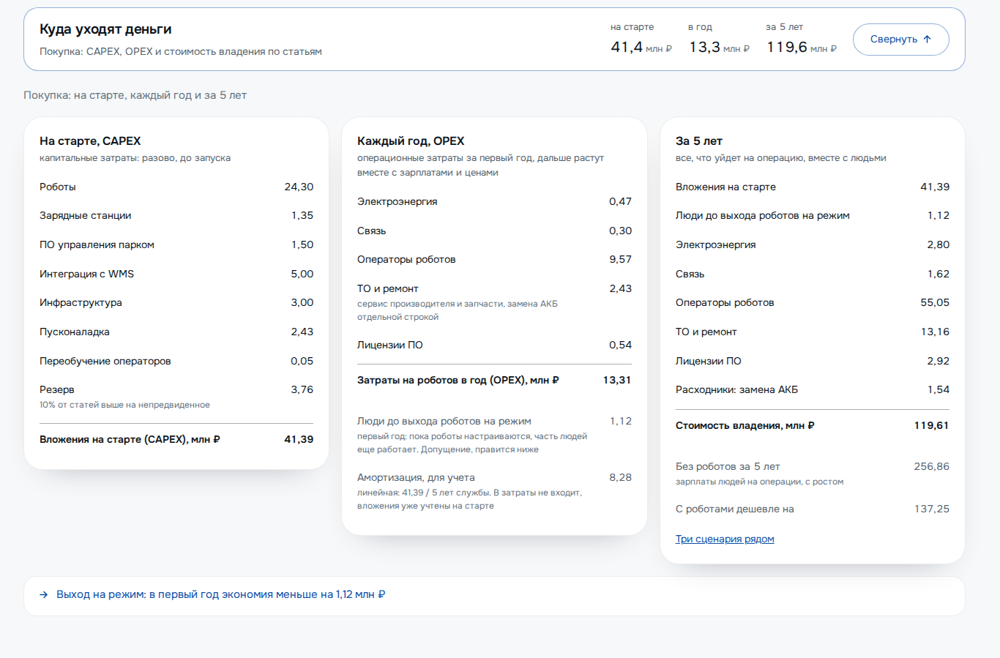

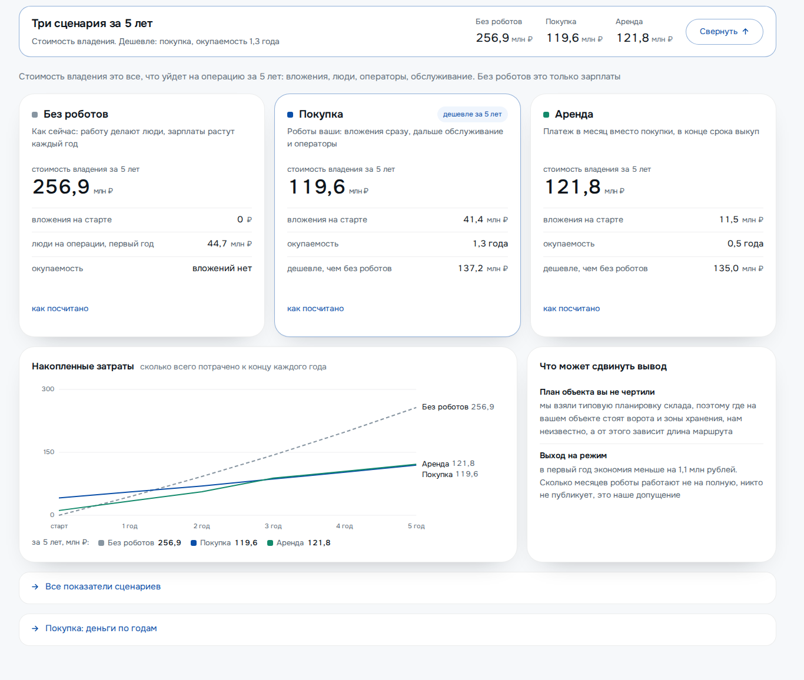

### Сценарий 2. Свой склад через шаблон

Проверяет загрузку параметров объекта из Excel или CSV и проверку границ (раздел 6.6, "Данные объекта пользователя").

1. Открыть http://localhost:3000/calc, выбрать склад и задачу, "Дальше: параметры".
2. На шаге 2 нажать "Скачать шаблон": файл приходит с текущими значениями по умолчанию (`GET /api/import/template`).
3. Поправить в шаблоне нужные поля своими значениями объекта. Если поставить число вне диапазона датасета, например отрицательную площадь или оклад в тысячи раз больше обычного, сервер это не примет.
4. Кнопкой "Загрузить Excel или CSV" загрузить файл обратно. Сервер проверяет типы, единицы, обязательные поля и границы из датасета и возвращает отчет по строкам: что принято, что отклонено и почему. Значения вне диапазона в расчет не попадают, а строка объясняет, какое поле и какая граница нарушена.
5. Пройти оставшиеся шаги мастера с загруженными значениями, посчитать и сверить, что параметры в отчете совпадают с файлом.

### Сценарий 3. Обновить каталог администратором

Проверяет загрузку выгрузки организатора через админку (раздел 6.6, "Каталог") — тот же путь, которым каталог пополняется, если файлов организатора нет в самой копии репозитория (например, их убрали перед тем как открыть репозиторий).

1. Войти демо-администратором: почта и пароль в `.env.example` (`DEMO_ADMIN_EMAIL`, `DEMO_ADMIN_PASSWORD`) или, на стенде, в документации для экспертов.
2. Открыть "Каталог" (`/admin`). Если файла организатора не было, в списке только наши 31 решение.
3. Нажать "Загрузить выгрузку" и выбрать файл `catalog_export_v4.csv` (CSV с разделителем `;`, UTF-8, формат организатора: колонки id, Название, тип, статус, компания, описание и так далее, раздел 6.6). Сначала показывается отчет, что добавится и что изменится, без записи в базу, затем загрузка подтверждается.
4. После загрузки в каталоге должны появиться позиции организатора (всего 190 при полной выгрузке), с пометкой источника "организатор" у полей. Фото у этих позиций не появится: они прикладываются отдельно, отдельного массового способа их загрузить в админке нет, только по одной картинке на карточке решения.
5. Повторная загрузка того же файла ничего не ломает: строки без изменений отмечаются как есть, ручные правки администратора не затираются.

Дальше в том же разделе "Нормативы" (`/admin?tab=norms`) можно поправить значения с источником и датой: кнопка "Загрузить файл" принимает CSV или Excel в том же формате, что отдает "Скачать нормативы".

## Что мы прорабатывали сами

В "Дополнениях для участников" (раздел 7) организатор перечислил пять тем, которые команда прорабатывает сама. Ниже по каждой: что решили, правила, цифры и где это лежит в коде и конфигурации. Чего в модели нет, так и написано.

### 1. Условия исключения неподходящих решений

Что решили. Решение не рекомендуется, если нарушено ключевое ограничение объекта. Если нужной характеристики нет ни в одном источнике, решение не выбрасываем, а ставим в группу "требует проверки" и пишем, чего не хватает. Выдача делится на три группы: подходит, требует проверки, не подходит (раздел 6.4). Неподходящее решение можно "все равно посчитать", экран предупреждает об этом.

Правила для склада (`backend/app/engine/selection.py`, пороги в `config/model.yaml`, раздел `engine.selection`):

| Что проверяем | Откуда берем | Не подходит | Требует проверки |
|---|---|---|---|
| Задача решения | Разметка задач `data/catalog/uses.csv`, в базе после подтверждения администратором | решение для другой задачи или задача не размечена | задача размечена с пометкой "требует проверки": решение может ее делать, но это никто не проверял |
| Грузоподъемность | Масса груза на шаге параметров, по умолчанию 800 кг из датасета | поднимает меньше груза | не опубликована; в каталоге линейка моделей; у отбора стационарная система, которая подает свою тару, а не стеллаж |
| Ширина прохода | Проезд на плане клиента | роботу нужно шире | не опубликована |
| Высота подъема | Верхний ярус стеллажей на плане, только у штабелеров (подъем выше 1 м) | | не достает до верхнего яруса |
| Пандус | Пандусы на плане, только у мобильных роботов | | уклон не публикует ни один производитель |
| Тип стеллажей | Набивные и мобильные стеллажи на плане | | робот работает только с торца блока |
| Зрелость | Статус в каталоге | | пилот не исключает, а снижает балл |

Бюджет на старте решение не исключает: сервис показывает, сколько роботов влезает в него со всеми вложениями и какую долю спроса они вытянут за смену.

Отбор товара. Кроме Ronavi M, который возит стеллажи к станции, восемь решений каталога могут подойти, но это никто не проверял: шесть низких роботов с подъемом (Ronavi H1500, AMR 800, AMR 1500, DMR 600, DMR 1200, Семабот) и две системы, которые организатор называет "товар к человеку" (AS-RS P и AS-RS B). Они стоят в "требует проверки" с причиной на карточке, а не в "не подходит". Две системы AS-RS в экономику не идут: расчетных параметров робота для них нет, карточка так и пишет. Остальные 22 решения склада для этой задачи не подходят по делу: уборка, инвентаризация, сортировка, погрузчики и штабелеры, хранение.

Предупреждение о пике решение не исключает: карточка до прогона смены говорит, что решение может не покрыть пик, если отбор "товар к человеку" стоит на плане под погрузчик или по формуле нужно больше 250 роботов (раздел 6.4).

Для аэропорта и медучреждения свои проверки (`data/facilities/solutions.csv` и `backend/app/services/facility_catalog.py`): можно ли купить (прототип и снятая модель не подходят), работа на морозе -25 °C для перрона, ширина коридора больницы, этажи и лифт, масса тележки или контейнера. Если диапазон температуры не опубликован, это "не проверили", а не "подходит".

Проверки плана дополняют подбор со стороны объекта: хватает ли проездов, доезжает ли робот до мест у стеллажей, не перекрывают ли зарядки и станции комплектации проезд. Станция между рядами стеллажей или на месте, откуда берут груз, не проходит проверку.

Чего нет: ровности пола, температуры склада, лифтов на складе и наличия WMS. Этих полей нет в каталоге организатора и мы их не нашли у производителей, правила ждут данных (раздел 6.9).

Решения: разделы "План идет в подбор решений", "Отметка "Протестировано ФЦ БАС" подтверждает работоспособность, а не цифры", "Шаг решения: карточками только подходящие, остальные списком строк", "Аэропорт и медучреждение: путь до списка решений, без плана и экономики" в `docs/decisions.md`.

### 2. Состав CAPEX и OPEX для сценариев покупки и услуги

Что решили. Статьи и формулы одни и те же в трех местах: в расчете на сервере, на экране, в отчете PDF и в таблицах Excel. Браузер ничего не складывает сам, сервер отдает готовые слагаемые, тест проверяет, что сумма слагаемых равна стоимости владения. Код: `capex_items`, `running_costs`, `owner_costs` и `build_years` в `backend/app/engine/economics/scenarios.py`.

CAPEX, год 0:

| Статья | Покупка | Роботы как услуга | Демо-расчет, покупка / услуга, млн ₽ |
|---|---|---|---|
| Роботы | парк * цена | в плате за месяц | 24,30 / 0 |
| Зарядные станции | станций * цена | в плате | 1,35 / 0 |
| ПО управления парком | один раз на производителя | в плате | 1,50 / 0 |
| Станции комплектации | станций * цена | станций * цена | 0 / 0 |
| Интеграция с WMS | на объект | на объект | 5,00 / 5,00 |
| Инфраструктура | на объект | на объект | 3,00 / 3,00 |
| Пусконаладка | 10% цены роботов | 10% цены роботов | 2,43 / 2,43 |
| Переобучение операторов | ставок * курс | ставок * курс | 0,05 / 0,05 |
| Резерв | 10% от статей выше | 10% от статей выше | 3,76 / 1,05 |
| Итого | | | 41,39 / 11,53 |

OPEX по годам:

| Статья | Покупка | Услуга, пока идет контракт | Услуга после выкупа |
|---|---|---|---|
| Люди, оставшиеся на операции | да | да | да |
| Электроэнергия | да | да | да |
| Связь | да | да | да |
| Операторы роботов | да | за вычетом доли поставщика | да |
| ТО и ремонт | 10% цены в год | в плате | да |
| Лицензии ПО | да | в плате | да |
| Замена АКБ | раз в ресурс батареи | в плате | да |
| Плата за услугу | нет | парк * плата в месяц * 12 | нет |
| Ответственность за порчу | нет | 1% цены в год | нет |
| Обновление парка | в год, кратный сроку службы | нет | да |

Как это согласовано с данными организатора:

- Легенда датасета пишет: OPEX это сервис, лицензии, электроэнергия и расходники, замена АКБ раз в 3-5 лет. У нас те же статьи: расходники это замена АКБ, а ТО и ремонт это сервис производителя вместе с запчастями и расходниками уборщиков одной ценой, так их продают. Долю расходников внутри сервиса никто не публикует.
- Резерв CAPEX 10% и замена АКБ взяты из легенды датасета без изменений.
- Цены каталога организатора с НДС, без доставки, пусконаладки и интеграции (Дополнения, п. 6). Поэтому пусконаладку и интеграцию мы добавляем отдельными статьями, а НДС не вычитаем ни в одном сценарии.
- Коэффициент взносов в датасете 1,302 включает травматизм 0,2%. Для складирования (ОКВЭД 52.10) по закону 0,6%, поэтому у нас 1,306. Это единственное место, где мы отступили от данных организатора, причина записана у значения.

Решения: разделы "Расходники это замена АКБ, IRR рядом с NPV", "ПО управления парком одно на производителя, лежит в общем на объект", "Зарядные станции: цена по трем производителям, у ДиКом в комплекте, роботов на станцию с потолком" в `docs/decisions.md`, статьи подробно в `docs/calculation.md`, разделы 3 и 4.

### 3. Допущения по отсутствующим или неполным данным

Что решили. Цифру без источника не прячем и не придумываем молча. Порядок такой: организатор, производитель, интегратор, СМИ; если нет, значение похожей модели с пометкой "аналог" и оценкой не выше D; если нет и аналога, допущение команды с оценкой F и словами "производитель не публикует, уточняем". При споре источников берем цифру организатора, но если актуальная страница производителя дает худшую для окупаемости, берем ее (`docs/data-sources.md`, разделы 2 и 4).

Сколько таких значений. Во всей модели 576 значений: S 13, A 8, B 23, C 110, D 226, E 21, F 175. В демо-расчете участвуют 75 значений, из них 26 с оценкой E или F. Счетчики по всей модели выдает `python -m scripts.run_example`, список значений расчета на экране в блоке "Откуда цифры", в отчете на последней странице.

Как показываем влияние на результат:

- В ответе расчета список слабых значений, на шаге экономики их число и каждое с источником и оценкой.
- Вывод содержит риски словами. В демо-расчете два: план типовой, а не клиента, и выход на режим (экономия первого года меньше на 1,1 млн ₽).
- "Что будет, если" сдвигает каждое число расчета на -20, -10, +10 и +20% и сортирует по размаху выгоды за горизонт. На складе с паллетами сильнее всего двигают результат люди в штате (102 млн ₽ за 5 лет), их оклад (80), доля работы, посильная роботам (53); цена робота 17, интеграция около 2.
- Главные допущения правятся руками: цена, обслуживание и срок службы робота в блоке "Что мы приняли за вас", выход на режим и условия оплаты на шаге экономики, нормативы у администратора.

Главные допущения и что от них зависит:

| Допущение | Значение | Оценка | Что будет, если ошиблись |
|---|---|---|---|
| Маршрут без плана клиента | типовой план, 65,7 м | F | по оценке из площади (75 м) выходит 10 роботов вместо 9, вложения 44,66 млн ₽ вместо 41,39, окупаемость 1,45 года вместо 1,33 |
| Внимание оператора на робота | 1,5 мин в час, минимум 1 дежурный в смену | F | если объекту нужно двое в смену, окупаемость покупки в демо-расчете уходит с 1,33 до 1,89 года |
| Интеграция и инфраструктура | 5 и 3 млн ₽ на объект | F | около 2 млн ₽ размаха выгоды при сдвиге на 20% |
| Пусконаладка | 10% цены роботов | F | 2,43 млн ₽ в демо-расчете |
| Выход на режим | 70% эффекта в первый месяц | F | минус 1,12 млн ₽ в первом году |
| Аренда у 13 роботов из 21 | как у Ronavi H1500 в доле от цены | F | только сценарий услуги |
| Тариф на электроэнергию | 9 ₽ за кВт*ч | F | 0,47 млн ₽ в год на 9 роботов |
| Строк за подачу стеллажа в отборе | 1,9, по симуляции Merschformann 2018 | D | при 1 строке роботов на демо отбора 105 вместо 56, окупаемость покупки уходит с 3,25 года за горизонт |

Цифры датасета мы проверяем источниками и логикой, а не берем на слово. Пример отбора товара: базовая выработка отборщика в датасете 150 строк в час, но в том же листе маршрут 25 м на строку. При обычной скорости отборщика 0,75-1 м/с и ходьбе в половину рабочего времени (Tompkins и др. 2003 по De Koster и др. 2007) выходит 54-79 строк в час. Поэтому берем нижнюю границу датасета, 80. Еще штат отборщиков датасета (100 человек) не закрывает и трети его же объема, поэтому людей на отборе считаем от объема по нормативу, а не долей от штата. Вместе с выработкой станции 250 строк в час (Яндекс Роботикс, факт Kiva 200-250) это меняет вывод по отбору: было "не окупается ни при каком объеме", стало 3,25 года при покупке. Проверку на внедрениях S&S Activewear, Decathlon и Яндекс Лавки мы записали в `docs/calculation.md`, раздел "Проверка на реальных внедрениях".

Решения: разделы "Отбор товара: цифры датасета проверяем, люди от объема", "При расхождении берем цифру организаторов, паспортное "до" справочное", "Доверие к цифре оцениваем одной шкалой, включая нормативы расчета", "Выход на режим включен по умолчанию, два вида задач" в `docs/decisions.md`, список недостающих данных в `docs/calculation.md`, раздел "Каких данных не хватает".

### 4. Логика экономической модели "роботы как услуга"

Что решили. Услугу считаем как фиксированную плату за робота в месяц с выкупом в конце контракта. Эту схему публикуют производители (Ronavi, Яндекс Роботикс), и ее можно проверить руками. Оплату за операцию и смешанную схему пока не считаем (раздел 6.9). Код: `build_years`, `buyout_share`, `raas_setup_amortization` в `backend/app/engine/economics/scenarios.py`, условия у каждого робота в `config/model.yaml`, раздел `raas`.

Структура платежей:

| Платеж | Когда | Как считаем | Демо-расчет |
|---|---|---|---|
| Разовый платеж за внедрение | год 0 | интеграция, инфраструктура, пусконаладка, переобучение, подбор, резерв 10% | 11,53 млн ₽ |
| Плата за услугу | каждый год контракта | парк * плата в месяц * 12, на срок контракта не меняется | 9 * 100 000 * 12 = 10,8 млн ₽ в год |
| Ответственность за порчу | каждый год контракта | 1% цены роботов в год с инфляцией | 0,24 млн ₽ в первый год |
| Выкуп | конец контракта | парк * цена * (1 - срок контракта / срок службы) | 9 * 2,7 * (1 - 3/5) = 9,72 млн ₽ в конце 3 года |
| Затраты владельца | после выкупа | как при покупке: ТО, лицензии, АКБ | с 4 года |

Что входит в плату: роботы, зарядки, ПО, ТО, ремонт и замена АКБ. Энергия, связь и операторы остаются на клиенте. Часть присмотра за парком поставщик может взять на себя (параметр `support_share`), по умолчанию ноль: сколько именно, никто не публикует.

Распределение во времени. Контракт 36 месяцев, расчет идет по годам, поэтому срок контракта кратен году. Если клиент продлевает, а не выкупает, плата индексируется на инфляцию за прошедший срок: `плата * (1 + инфляция)^(срок * номер продления)`. На экране всегда выкуп, продление доступно через API (`raas_buyout: false`). Разовый платеж за внедрение списывается линейно за срок контракта, выкуп за оставшийся срок службы.

Оценка эффекта. Эффект года это затраты на людей без роботов минус люди после роботов и все затраты услуги. Показатели те же, что у покупки: окупаемость по накопленному потоку, ROI, TCO, NPV, IRR. В демо-расчете поток услуги по годам 22,16, 25,67, 18,51 (выкуп 9,72), 38,71, 41,51 млн ₽. Окупаемость 0,52 года, TCO 121,82 млн ₽ против 119,61 у покупки, NPV 84,64 млн ₽ против 78,81: услуга дороже за 5 лет на 2,2 млн ₽, но на старте требует 11,5 млн ₽ вместо 41,4 и дает больший NPV, потому что выкуп отложен на три года. Сводка на экране открывается покупкой, услуга переключателем рядом, какой сценарий дешевле за горизонт, помечено на плитке. Если у решения нет цены услуги, сценарий не показывается; у объекта из нескольких задач услуга есть, только если цена есть у решений всех задач.

Откуда цена. Цена услуги с источником есть у 8 роботов из 21: Ronavi H1500 (100 000 ₽ в месяц, 2019 год, оценка D), Ronavi M, два уборщика Клинботикс, MARK 2 SE, РУБИ-С-03, Автомакон АК-SC80 и Unit. У остальных 13 аренду производитель не публикует, и мы берем ее как у H1500 в доле от цены робота, оценка F. Проверка на кейсе Восток-Сервиса: при цене 100 тыс. ₽ окупаемость за 6 месяцев сходится, если внедрение стоило до 28 млн ₽ (`docs/calculation.md`, "Проверка на реальных внедрениях").

Решения: разделы "Аренда роботов: фиксированная плата с выкупом", "Сценарии сравнения взяты из ТЗ", "Сводка экономики всегда открывается покупкой" в `docs/decisions.md`, раздел 5 в `docs/calculation.md`.

### 5. Расширение каталога и работа с открытыми источниками

Что решили. Каталог организатора (223 позиции, после склейки дублей 190) мы не переписывали, а дополнили характеристиками из открытых источников для тех решений, которые участвуют в расчете, и добавили решения для объектов, где каталога мало.

Глубина по типам объектов:

| Объект | Решений с характеристиками | Из каталога | Из открытых источников | Глубина |
|---|---|---|---|---|
| Склад | 31 | 31 | 0 | характеристики с источниками, у 21 робота расчетные параметры, полный расчет |
| Аэропорт | 12 | 6 | 6 | характеристики, проверки по параметрам объекта, без экономики |
| Медучреждение | 18 | 10 | 8 | то же |

Критерии отбора для склада (`data/specs/README.md`): сценарий "Внутрискладская логистика", "Сортировка грузов", "Инвентаризация склада" или "Уборка помещений" (36 позиций), минус 4 в статусе "разработка" (их нельзя купить) и Pick by Voice (программа без оборудования). Для аэропорта и больницы из каталога подходят 6 и 3 позиции, этого мало, чтобы показать выбор. Добавили решения под задачи из датасета организатора (уборка терминала, буксировка тележек, консультации пассажиров, доставка по этажам с лифтом, перевозка тележек с питанием и бельем, обеззараживание), и только если у решения есть страница производителя или дилера с характеристиками. Уборщики из каталога подходят и больнице, их отметили для обоих объектов. У каждого решения в `data/facilities/solutions.csv` записано, почему взяли, какие ограничения и можно ли купить его в России.

Источники. В `data/specs/sources.csv` около 1 600 значений по 51 решению, каждое со ссылкой, цитатой, датой и типом источника: производитель 579, организатор 390, интегратор 187, СМИ 128, эксплуатант 12, остальные без источника с пометкой. Больше всего значений с сайтов Ronavi, kiit.ru, robob2b.ru, Waybot, Автомакона, RoboCV, R2B, ДиКом, Pudu, Gausium, Aethon. Оценки: A 36, B 28, C 183, D 65, E 22, F 113 из 447 характеристик. Отраслевые цифры и похожие модели (батареи, ПО, обслуживание) в `data/specs/analogs.csv`.

Как каталог обновляется. Администратор загружает новую выгрузку организатора, ручные правки она не затирает. Кнопка "Проверить обновления" сверяет характеристики со страницами производителей, расхождение больше 10% становится предложением, администратор принимает или отклоняет его (раздел 6.6). Сайты, которые запрещают автоматический сбор, не открываем.

Чего нет: характеристик у 132 позиций каталога без объекта (другие отрасли) и автоматического поиска новых решений. Новые позиции добавляет администратор.

Решения: разделы "Для склада берем 31 решение из каталога", "Решения для аэропорта и медучреждения: каталог плюс открытые источники", "Автообновление характеристик: сверяем страницы производителей, правку принимает администратор", "Характеристики собираем полуавтоматически, принимает человек" в `docs/decisions.md`.

## Приложение А. Демо-учетные записи

| Роль | Почта | Пароль |
|---|---|---|
| Пользователь | demo@example.com | demo12345 |
| Администратор | admin@example.com | admin12345 |

Аккаунты создаются при первом запуске. На экране входа в них можно войти кнопками "Демо: пользователь" и "Демо: администратор" без пароля. Почты и пароли задаются в `.env`, выше значения для запуска у себя. На стенде https://rasklad-robots.ru вход без пароля выключен, пароли демо-аккаунтов там другие: они в материалах сдачи.

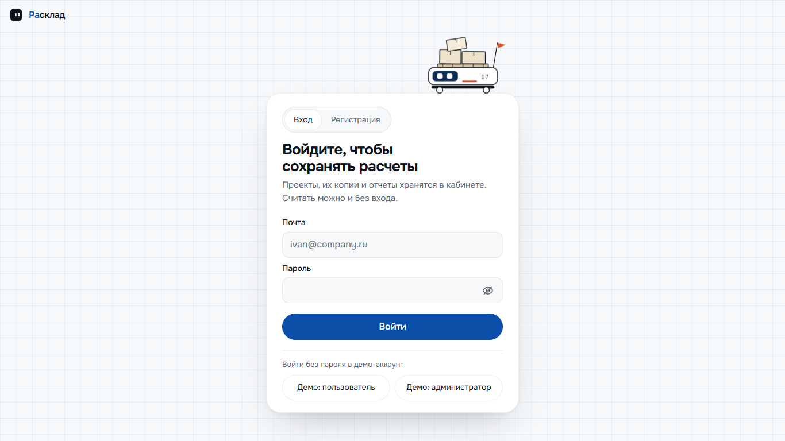

## Приложение Б. Демо-данные и сценарий проверки основных функций

Сценарий идет на своем запуске (раздел 6.2). Его же можно пройти на стенде https://rasklad-robots.ru: сайт закрыт общим логином и паролем, демо-вход кнопками выключен, логин и пароль стенда и демо-аккаунтов в материалах сдачи.

### Что есть после первого запуска

- Каталог 190 позиций: наши 31 складское решение с характеристиками и источниками и выгрузка организатора. По объектам: склад 45, аэропорт 13, медучреждение 10, без объекта 132. У 21 позиции задачу предложило правило, она ждет подтверждения администратора.
- Нормативы по умолчанию из `config/model.yaml`, 55 значений открыты администратору.
- Значения по умолчанию объектов из `Датасеты_хакатон.xlsx`: склад, аэропорт, медучреждение.
- Демо-аккаунты пользователя и администратора. Вернуть исходное состояние: `docker compose exec backend python -m scripts.reset_demo`.

### Сценарий проверки, около 15 минут

| № | Действие | Что должно получиться |
|---|---|---|
| 1 | Открыть http://localhost:3000, "Посчитать свой склад", пройти шаги по разделу 6.10 | Парк 9 роботов, покупка окупается за 1,3 года, вложения 41,4 млн ₽ |
| 2 | На шаге 5 посмотреть смену на плане, запустить с другой скоростью, раскрыть "Откуда цифры" | Роботы едут по плану, итоги смены справа, у каждой цифры источник и оценка |
| 3 | На шаге 2 поменять оклад оператора погрузчика или объем, вернуться на шаг 5 | Цифры пересчитаны, правка видна в "Откуда цифры" |
| 4 | Скачать "Отчет PDF" и "Таблицы Excel" | Файлы как в `docs/example/` |
| 5 | Войти кнопкой "Демо: пользователь", сохранить расчет в проект | Проект в кабинете с главными цифрами, на главной план склада |
| 6 | В кабинете сделать копию "что будет, если", поменять объем, сравнить с оригиналом | Копия и оригинал рядом в сравнении |
| 7 | На шаге 4 задать бюджет 20 млн ₽ или взять второе решение с долей объема; на шаге 5 в строке "Чем платить" выбрать кредит | Сколько роботов влезает в бюджет; панель условий с платежом в месяц и окупаемостью с учетом долга |
| 8 | Выбрать аэропорт на шаге 1 | Параметры аэропорта и список решений с объяснением, без плана и экономики, блок "Что дальше" |
| 9 | Войти кнопкой "Демо: администратор" | Главная администратора: что ждет решения, графики, журнал |
| 10 | Каталог: открыть карточку Ronavi H1500, поменять цену, пересчитать демо-расчет | Новая цена в экономике и в "Откуда цифры" с почтой администратора |
| 11 | Каталог "Деревом", "Скачать каталог", "Загрузить выгрузку" в режиме проверки | Дерево по отраслям и объектам, файл в формате организатора, отчет загрузки |
| 12 | "Проверить обновления", "По сохраненным страницам" | Совпало 20, расходится 0, проверить руками 2 |
| 13 | Вкладка "Нормативы": поправить норматив и вернуть значение из файла | Правка в журнале, расчет идет с новым значением |
| 14 | Открыть http://localhost:8000/api/docs | Описание всех точек API |

## Приложение В. Пример выгруженного отчета

Отчет и таблицы демо-расчета из раздела 6.10 лежат в репозитории:

- `docs/example/report.pdf`: отчет PDF на 13 страниц с пометкой "предварительная оценка": ответ, три сценария, затраты по годам, что может сдвинуть вывод, все показатели, способ оплаты, что будет, если, объект и параметры, план объекта, смена на плане, что подготовить на складе, решение и оборудование, из чего сложились затраты, штат, откуда цифры.
- `docs/example/report.xlsx`: расчетные таблицы Excel, листы "Итог", "По годам", "Затраты", "Что будет, если", "Парк и штат", "Смена", "Параметры", "Источники".
- `docs/example/request.json`: запрос расчета, из которого получены оба файла.
